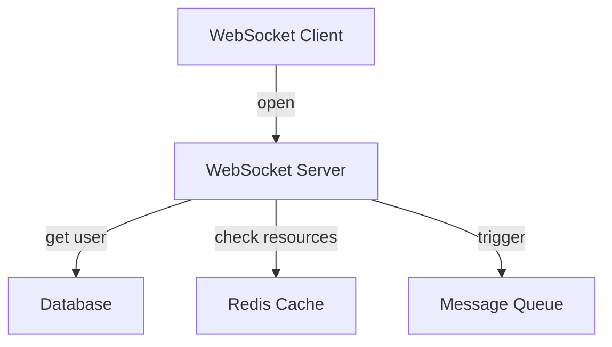
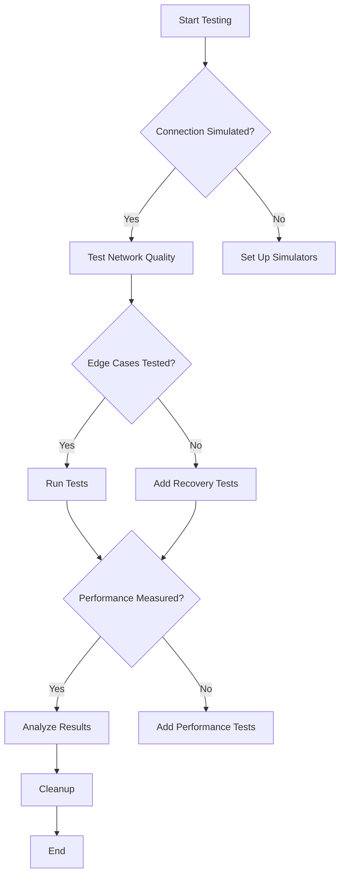

```markdown
# Mastering Real-Time Features: The Subscription Testing Pattern

## Introduction: Why Subscription Testing Matters

In modern backend systems, real-time capabilities have shifted from nice-to-haves to critical requirements. Whether it's live updates to in-game scores, instant notifications for financial transactions, or collaborative editing in documents, applications increasingly depend on maintaining persistent connections between clients and servers.

However, building and maintaining such systems introduces unique testing challenges. Traditional request-response testing strategies fall short when dealing with WebSockets, Server-Sent Events (SSE), or long-lived HTTP connections. Subscription testing emerged as a dedicated pattern to address these challenges head-on.

This tutorial dives deep into the subscription testing pattern, examining its core concepts through real-world examples, practical implementation guidance, and common pitfalls to avoid. By the end, you'll understand how to create robust tests for your real-time systems that validate both happy paths and edge cases effectively.

---

## The Problem: Why Traditional Testing Fails for Real-Time Features

Before we explore solutions, let's examine the core problems that subscription testing addresses:

### 1. Connection Lifespan Challenges
```javascript
// Traditional request-response flow
const response = await fetch('/api/data');
console.log(response.json()); // Done in milliseconds
```

This contrasts with real-time subscriptions:
```javascript
// WebSocket subscription flow
const socket = new WebSocket('wss://api.example.com/subscriptions');
socket.onmessage = (event) => { /* Handle updates */ };
// Connection lasts for minutes, hours, or indefinitely
```

The biggest challenge is that test durations can't match production lifespans. When do you close the connection? How do you ensure reliability over time?

### 2. State Management Complexity
Real-time systems maintain application state across multiple clients simultaneously. Testing requires verifying:
- Correct state propagation
- Proper synchronization
- Handling of concurrent updates

### 3. Event Ordering Assumptions
In synchronous systems, you can assume requests execute sequentially. In real-time systems:
```javascript
// Sequential updates
socket.send(JSON.stringify({action: "update", field: "stock"}));

// Parallel updates (what actually happens)
socket.send(JSON.stringify({action: "update", field: "stock"}));
socket.send(JSON.stringify({action: "update", field: "user"})); // Might arrive before previous
```

### 4. External Resource Dependencies
Real-time systems often interact with databases, caches, and other services:


Even simple tests require mocking these dependencies properly.

### 5. Connection Recovery Scenarios
The real world includes:
- Network interruptions
- Client restarts
- Server restarts during subscription
- Long connection gaps

Testing must account for these scenarios where traditional integration tests typically focus only on success cases.

---

## The Solution: Subscription Testing Pattern

Subscription testing transforms how we approach real-time feature validation by:
1. **Emulating real connection lifespans** with configurable durations
2. **Isolating tests** while maintaining realistic environments
3. **Validating edge cases** without affecting production systems
4. **Measuring performance** characteristics specific to real-time
5. **Supporting recovery scenarios** that are impossible to test with traditional approaches

The core components include:

### 1. Subscription Test Environment
A controlled environment that:
- Manages connection lifespans
- Provides mock or real dependencies
- Tracks message flow
- Handles test isolation

### 2. Connection Simulation Layer
Simulates various:
- Network conditions
- Connection quality
- Interruption patterns

### 3. State Verification Framework
Verifies:
- Correct message reception
- State consistency
- Event ordering compliance
- Graceful degradation

### 4. Recovery Test Suite
Tests:
- Connection re-establishment
- State synchronization
- Error handling flows

---

## Implementation Guide: Building Subscription Tests

### 1. Basic Subscription Test Structure

```javascript
// test/subscription.test.js
const { createTestWebSocketServer } = require('./test-helpers');
const WebSocket = require('ws');

describe('Subscription Service', () => {
  let server;
  let clientSocket;
  let testTimeout;

  beforeAll(async () => {
    server = createTestWebSocketServer();
    await server.listen(0); // Pick free port
    testTimeout = setTimeout(() => {
      cleanup();
      throw new Error('Test timed out');
    }, 10000); // 10 second timeout
  }, 10000);

  afterAll(() => {
    clearTimeout(testTimeout);
    server.close();
  });

  test('should handle real-time updates', async () => {
    clientSocket = new WebSocket(`ws://localhost:${server.address().port}/subscriptions`);

    return new Promise((resolve, reject) => {
      // Test logic here
      clientSocket.on('open', () => {
        // Send subscription request
        clientSocket.send(JSON.stringify({ type: 'subscribe', channel: 'stocks' }));
      });

      clientSocket.on('message', (data) => {
        const message = JSON.parse(data);
        if (message.type === 'update' && message.symbol === 'AAPL') {
          expect(message.price).toBeGreaterThan(100);
          resolve();
        }
      });

      clientSocket.on('close', reject);
    });
  });
});
```

### 2. Advanced Pattern: Message Test Harness

This pattern isolates message testing from connection concerns:

```javascript
// test/message-harness.js
class MessageHarness {
  constructor() {
    this.received = [];
    this.errorCallbacks = [];
    this.timeout = 0;
    this.timeoutCallback = null;
  }

  onMessage(callback) {
    this.received.push(callback);
  }

  onError(callback) {
    this.errorCallbacks.push(callback);
  }

  async runTest(recvHandler, errorHandler, timeout = 0) {
    this.timeout = timeout;
    const promise = new Promise((resolve, reject) => {
      this.timeoutCallback = setTimeout(() => {
        reject(new Error('Message test timed out'));
      }, timeout);
    });

    // Simulate receiving messages
    const mockMessages = [
      { type: 'update', data: 'value1' },
      { type: 'update', data: 'value2' }
    ];

    for (const msg of mockMessages) {
      this.received.forEach(callback => callback(msg));
    }

    clearTimeout(this.timeoutCallback);
    return promise;
  }

  async testConnection(clientSocket, testDuration) {
    const harness = new MessageHarness();
    clientSocket.on('open', () => {
      console.log('Connection established');
    });

    clientSocket.on('message', (data) => {
      harness.received.push(msg => {
        // Test message content
        expect(JSON.parse(data).type).toBe('update');
      });
    });

    clientSocket.on('error', (err) => {
      harness.errorCallbacks.forEach(cb => cb(err));
    });

    // Run for specified duration or handle cleanup
    await new Promise(resolve => setTimeout(resolve, testDuration));
    clientSocket.close();
  }
}
```

### 3. Database Simulation for Real-Time Features

For testing database-backed subscriptions:

```sql
-- test/setup-subscription-table.sql
CREATE TABLE realtime_subscriptions (
  id SERIAL PRIMARY KEY,
  user_id INT NOT NULL,
  channel_name VARCHAR(50) NOT NULL,
  last_notified_at TIMESTAMP NULL,
  subscription_data JSONB NULL,
  created_at TIMESTAMP NOT NULL DEFAULT NOW(),
  updated_at TIMESTAMP NOT NULL DEFAULT NOW(),
  UNIQUE(user_id, channel_name)
);

CREATE INDEX idx_subscriptions_channel ON realtime_subscriptions(channel_name);
CREATE INDEX idx_subscriptions_user ON realtime_subscriptions(user_id);
```

```javascript
// test/database-subscription-test.js
const { Pool } = require('pg');
const { createSubscriptionClient } = require('../src/subscription-service');

describe('Database-backed Subscriptions', () => {
  let dbPool;
  let subscriptionClient;

  beforeAll(async () => {
    dbPool = new Pool({
      connectionString: process.env.TEST_DB_URL,
      ssl: process.env.NODE_ENV === 'test' ? { rejectUnauthorized: false } : false
    });

    subscriptionClient = createSubscriptionClient(dbPool);
  });

  afterAll(async () => {
    await dbPool.end();
  });

  test('should handle concurrent subscription updates', async () => {
    // Setup: Create 2 concurrent users subscribed to same channel
    const user1 = { id: 1, channel: 'stocks' };
    const user2 = { id: 2, channel: 'stocks' };

    // Track notifications
    const notifications = [];

    // Mock subscription notifications
    subscriptionClient.subscribe(user1, (msg) => {
      notifications.push(msg);
    });

    subscriptionClient.subscribe(user2, (msg) => {
      notifications.push(msg);
    });

    // Trigger update
    await subscriptionClient.publish('stocks', { symbol: 'AAPL', price: 150 });

    // Verify both subscribers received update
    expect(notifications.length).toBe(2);
    const [user1Msg, user2Msg] = notifications;
    expect(user1Msg).toMatchObject({ symbol: 'AAPL', price: 150 });
    expect(user2Msg).toMatchObject({ symbol: 'AAPL', price: 150 });
  });
});
```

### 4. Connection Quality Simulation

```javascript
// test/connection-quality-simulator.js
class ConnectionQualitySimulator {
  constructor() {
    this.packetLoss = 0; // 0-1
    this.latency = 0;    // in milliseconds
    this.jitter = 0;     // standard deviation
    this.connectionDrops = 0;
    this.dropDuration = 1000; // ms
  }

  simulateConnection(realSocket, port) {
    const server = createTestWebSocketServer((ws) => {
      // Record initial state
      const originalSend = ws.send;
      const originalClose = ws.close;

      ws.send = (data, options) => {
        // Simulate packet loss
        if (Math.random() < this.packetLoss) {
          return;
        }

        // Simulate latency
        setTimeout(() => {
          originalSend.call(ws, data, options);
        }, this.latency + Math.random() * this.jitter);
      };

      ws.close = (code, reason) => {
        // Simulate random drops
        if (Math.random() < this.connectionDrops) {
          setTimeout(() => {
            originalClose.call(ws, code, reason);
          }, this.dropDuration);
        } else {
          originalClose.call(ws, code, reason);
        }
      };
    });

    return server;
  }
}
```

### 5. Integration Test Example with Publish/Subscribe

```javascript
// test/subscription-integration-test.js
const { createMockWebSocketServer } = require('mock-socket');
const { pubSub } = require('../src/pubsub-service');

describe('Pub/Sub System Integration', () => {
  let mockServer;
  let mockClient;
  let subscriber;

  beforeEach(() => {
    mockServer = createMockWebSocketServer({ url: 'ws://test-host:8080' });

    // Create a mock client
    mockClient = new WebSocket('ws://test-host:8080');

    // Track subscribers
    subscriber = {
      on: jest.fn(),
      send: jest.fn()
    };

    // Setup pub/sub to use our mock server
    pubSub.setup = jest.fn().mockImplementation(() => {
      // Connect to our mock server
      const realSocket = new WebSocket('ws://test-host:8080');
      // In a real implementation, we'd properly connect here
    });
  });

  afterEach(() => {
    mockServer.close();
  });

  test('should handle concurrent publisher and subscriber', (done) => => {
    // Setup subscriber mock
    mockClient.onopen = () => {
      // Simulate subscription
      mockClient.send(JSON.stringify({
        type: 'subscribe',
        channel: 'news'
      }));
    };

    mockClient.onmessage = (event) => {
      if (event.data.type === 'message') {
        expect(event.data.channel).toBe('news');
        expect(event.data.content).toBe('Breaking news!');
        done();
      }
    };

    // Simulate publisher
    setTimeout(() => {
      pubSub.publish('news', 'Breaking news!');
    }, 100);

    // Verify message flow
    expect(mockServer).toHaveReceivedMessages([
      JSON.stringify({ type: 'subscribe', channel: 'news' })
    ]);
  });
});
```

---

## Common Mistakes to Avoid

1. **Testing Without Connection Simulation**: Testing only happy paths without accounting for real-world network conditions leads to brittle tests that fail in production.

   ```javascript
   // ❌ Problem: No connection simulation
   test('should handle updates', async () => {
     const client = new WebSocket('ws://api.example.com');
     client.onmessage = (msg) => { /* ... */ };
     // No way to account for packet loss or latency
   });
   ```

2. **Assuming Perfect Order**: Not verifying that out-of-order messages are handled gracefully can lead to inconsistent state.

   ```javascript
   // ❌ Problem: Doesn't test event ordering
   test('should process messages in order', () => {
     // Test only sequential delivery, but not what happens when messages arrive out of order
   });
   ```

3. **Ignoring Resource Constraints**: Testing with unlimited resources can mask performance issues.

   ```javascript
   // ❌ Problem: No resource throttling
   test('should handle 10K concurrent users', async () => {
     // No mechanism to actually create this many connections
   });
   ```

4. **Testing Only Happy Paths**: Failing to test error recovery scenarios means production crashes may go unnoticed.

   ```javascript
   // ❌ Problem: No recovery testing
   test('should update stock price', () => {
     // Only tests successful updates
   });
   ```

5. **Not Isolating State Changes**: Tests that modify shared state can interfere with each other.

   ```javascript
   // ❌ Problem: Shared test state
   describe('Subscription Service', () => {
     // Test 1 and Test 2 both modify the same subscription table
     // with no cleanup between them
   });
   ```

6. **Over-relying on Production-like Components**: Using real databases or message brokers in tests can slow down your suite significantly.

   ```javascript
   // ❌ Problem: Real dependencies in tests
   const testDB = new DatabaseConnection('production-db-url');
   // No isolation or mocking
   ```

---

## Key Takeaways

- Subscription testing **requires structured approaches** to handle long-lived connections and stateful interactions
- Use **connection simulation** to test real-world network conditions without affecting production
- **Isolate tests** to prevent interference between test cases with shared resources
- **Validate edge cases** like connection drops, message loss, and out-of-order delivery
- **Measure performance** characteristics specific to real-time systems (latency, throughput)
- **Test recovery scenarios** thoroughly, including:
  - Connection re-establishment
  - State synchronization
  - Error handling
- **Use mocks and stubs** judiciously to balance realism with test speed
- **Implement test cleanup** properly to avoid resource leaks
- **Combine unit and integration tests** for comprehensive coverage



---

## Conclusion: Building Robust Real-Time Systems

Subscription testing represents a fundamental shift in how we approach testing real-time backend systems. While it requires more effort upfront than traditional testing approaches, the payoff in production reliability and reduced debugging time is immense.

The pattern provides a framework to:
1. Create tests that accurately reflect real-world usage patterns
2. Validate system behavior over extended periods
3. Isolate issues to specific components
4. Measure performance characteristics
5. Ensure graceful degradation under adverse conditions

As real-time capabilities become more ubiquitous in modern applications—from financial trading platforms to collaborative tools—the importance of robust subscription testing can't be overstated. By implementing these patterns, you'll build systems that deliver reliable real-time experiences while maintaining testability and maintainability.

Remember that there's no one-size-fits-all solution. You'll need to adapt these concepts to your specific use cases, balancing realism with test speed and maintenance overhead. Start with focused tests for critical paths, gradually expanding coverage as you identify key scenarios that need validation.

The future of backend development increasingly demands real-time capabilities, and the ability to test these systems effectively is becoming a competitive advantage. Subscription testing gives you the tools to build and maintain systems that deliver real-time value consistently and reliably.

```javascript
// Final checklist for implementing subscription testing
const subscriptionTestChecklist = [
  // Core Implementation
  '✓ Use a dedicated test environment for subscriptions',
  '✓ Implement connection simulation with configurable quality',
  '✓ Create message test harness for isolated testing',

  // Integration Testing
  '✓ Test database-backed subscriptions with controlled state',
  '✓ Verify state synchronization across subscribers',
  '✓ Test concurrent updates and collision handling',

  // Edge Cases
  '✓ Simulate network interruptions and reconnection',
  '✓ Test message timeout handling',
  '✓ Verify error recovery scenarios',

  // Performance
  '✓ Measure latency under load',
  '✓ Test throughput with concurrent connections',
  '✓ Profile memory usage over connection duration',

  // Best Practices
  '✓ Isolate tests with proper cleanup',
  '✓ Use mocks for external dependencies when appropriate',
  '✓ Implement test configuration for different scenarios',
  '✓ Document test assumptions and limitations'
];

// console.log(subscriptionTestChecklist) // Remember these as you build!
```