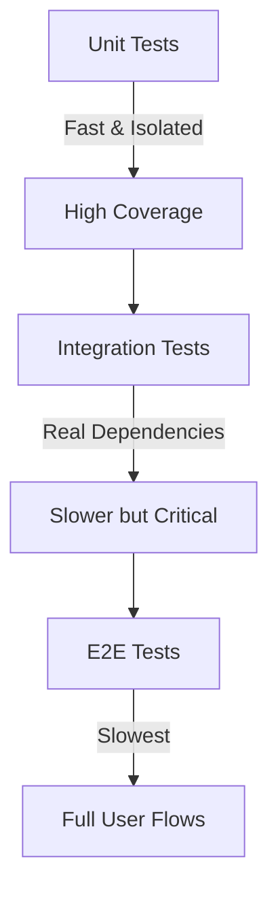

```markdown
# **Testing Guidelines Pattern: Building Reliable Backend Systems**

Writing testable code isn't just a good practice—it’s a necessity. Without structured testing guidelines, your API endpoints may behave inconsistently, hidden bugs lurk in production, and deployments become a gamble.

In this guide, we’ll explore the **Testing Guidelines Pattern**—a structured approach to writing tests that ensures reliability, maintainability, and efficiency. We’ll cover:
- Why testing guidelines matter in backend development
- Real-world challenges without them
- Practical examples in Python (FastAPI) and JavaScript (Express.js)
- Common pitfalls and how to avoid them
- A checklist to follow in your projects

By the end, you’ll have a clear, actionable strategy to improve your testing workflow.

---

## **The Problem: Development Without Testing Guidelines**

Testing is often an afterthought. Teams rush to ship features, only to realize later that their tests:
- **Are inconsistent.** Some endpoints are tested rigorously, while others are skipped entirely.
- **Have false positives/negatives.** Flaky tests ruin CI/CD pipelines, wasting developer time.
- **Don’t cover edge cases.** Hidden bugs in production cause downtime and user frustration.
- **Are hard to maintain.** Tests become slow, duplicative, or brittle over time.

### **Real-World Example: The API That Broke in Production**
Imagine a payment service where:
- A `POST /checkout` endpoint was tested only with valid inputs.
- No tests covered race conditions when concurrent payments were processed.
- A backend change introduced a subtle bug where payments sometimes failed silently.

**Result?** Users faced failed transactions, and the team had to scramble to debug without proper test coverage.

This scenario happens more often than you’d think. Without clear testing guidelines, even experienced developers can fall into untested behavior.

---

## **The Solution: The Testing Guidelines Pattern**

The **Testing Guidelines Pattern** provides a structured way to:
1. **Define test strategy** (unit, integration, end-to-end).
2. **Standardize test naming and structure** for scalability.
3. **Enforce test quality** (avoid flakiness, redundancy).
4. **Automate testing** to catch regressions early.

### **Key Components of the Pattern**
| Component          | Purpose                                                                 |
|--------------------|--------------------------------------------------------------------------|
| **Test Pyramid**   | Balance unit, integration, and E2E tests to optimize speed and coverage. |
| **Test Naming**    | Clear, descriptive names (e.g., `test_create_user_with_invalid_email`). |
| **Mocking Strategy** | Decide when to use mocks vs. real dependencies.                         |
| **Test Data**      | Standardize test stubs and fixtures.                                   |
| **CI/CD Integration** | Run tests automatically on every commit.                               |

---

## **Code Examples: Putting the Pattern into Practice**

Let’s apply these guidelines in two popular backends: **FastAPI (Python)** and **Express.js (Node.js)**.

---

### **1. FastAPI Example: Structured Unit Tests**

#### **Before (No Guidelines)**
```python
# tests/test_users.py
def test_create_user():
    response = client.post("/users", json={"name": "John"})
    assert response.status_code == 201
```

**Problems:**
- No test naming convention.
- Hard to track what’s covered.
- No error handling checks.

#### **After (With Guidelines)**
```python
# tests/test_users.py
import pytest
from fastapi.testclient import TestClient
from app.main import app

client = TestClient(app)

def test_create_user_success():
    """Test successful user creation with valid inputs."""
    response = client.post(
        "/users",
        json={"name": "John", "email": "john@example.com"}
    )
    assert response.status_code == 201
    assert response.json()["name"] == "John"

def test_create_user_invalid_email():
    """Test user creation with invalid email format."""
    response = client.post(
        "/users",
        json={"name": "John", "email": "invalid-email"}
    )
    assert response.status_code == 422  # Unprocessable Entity
    assert "email" in response.json()["detail"]

def test_create_user_duplicate_email():
    """Test duplicate email handling."""
    # First, create a user
    client.post(
        "/users",
        json={"name": "Alice", "email": "alice@example.com"}
    )
    # Try creating another with the same email
    response = client.post(
        "/users",
        json={"name": "Bob", "email": "alice@example.com"}
    )
    assert response.status_code == 400
    assert "already exists" in response.json()["detail"]
```

**Key Improvements:**
✅ **Descriptive names** (`test_create_user_duplicate_email`).
✅ **Clear assertions** (check both status codes and response body).
✅ **Edge cases covered** (invalid email, duplicates).

---

### **2. Express.js Example: Integration Testing with Supertest**

#### **Before (No Guidelines)**
```javascript
// test/user.test.js
const request = require('supertest');
const app = require('../app');

test('Create user', async () => {
    const res = await request(app).post('/users').send({ name: 'Alice' });
    expect(res.statusCode).toBe(201);
});
```

#### **After (With Guidelines)**
```javascript
// test/user.test.js
const request = require('supertest');
const app = require('../app');

describe('POST /users', () => {
    // Fixture: Pre-populated test user
    const validUser = { name: 'Bob', email: 'bob@example.com' };
    const invalidUser = { name: '', email: 'not-an-email' };

    beforeAll(async () => {
        // Optional: Seed test database if needed
    });

    afterAll(async () => {
        // Clean up test data
    });

    it('should create a user with valid data', async () => {
        const res = await request(app)
            .post('/users')
            .send(validUser);

        expect(res.statusCode).toBe(201);
        expect(res.body).toHaveProperty('id');
        expect(res.body.name).toBe(validUser.name);
    });

    it('should reject invalid email format', async () => {
        const res = await request(app)
            .post('/users')
            .send({ ...validUser, email: 'invalid' });

        expect(res.statusCode).toBe(400);
        expect(res.body.error).toContain('Invalid email');
    });
});
```

**Key Improvements:**
✅ **Test suite structure** (`describe` blocks for endpoints).
✅ **Test data standardization** (fixtures like `validUser`).
✅ **Cleanup after tests** (`afterAll`).

---

## **Implementation Guide: How to Apply Testing Guidelines**

### **Step 1: Define Your Test Strategy**
Use the **Testing Pyramid** to balance test types:
- **Unit Tests (70%)** → Test individual functions (e.g., `validate_email()`).
- **Integration Tests (20%)** → Test API endpoints with mocked dependencies.
- **End-to-End Tests (10%)** → Test full user flows.



### **Step 2: Enforce Test Naming Conventions**
Follow this template:
```
test_[endpoint_method]_with_[scenario]
```
Example:
- `test_get_products_with_valid_id`
- `test_create_user_with_duplicate_email`

### **Step 3: Mock External Dependencies**
Avoid running real database queries in unit tests.
**FastAPI Example:**
```python
from unittest.mock import patch
from fastapi.testclient import TestClient

@patch('app.database.get_user')
def test_get_user(mock_get_user):
    mock_get_user.return_value = {"id": 1, "name": "Alice"}
    response = client.get("/users/1")
    assert response.json() == {"id": 1, "name": "Alice"}
```

### **Step 4: Automate Test Runs**
Integrate tests into CI/CD (GitHub Actions, GitLab CI, etc.).
**Example `.github/workflows/tests.yml`:**
```yaml
name: Run Tests
on: [push]
jobs:
  test:
    runs-on: ubuntu-latest
    steps:
      - uses: actions/checkout@v2
      - run: pip install -r requirements.txt
      - run: pytest tests/
```

### **Step 5: Keep Tests Fast**
- Avoid slow operations (e.g., database queries in unit tests).
- Cache fixtures to reduce reprovisioning time.

---

## **Common Mistakes to Avoid**

| Mistake                          | Why It’s Bad                          | Solution                          |
|----------------------------------|---------------------------------------|-----------------------------------|
| **No test naming conventions**   | Hard to track coverage.               | Use `test_[method]_with_[scenario]`. |
| **Over-mocking**                 | Tests behave differently in production. | Use real dependencies where possible. |
| **Ignoring edge cases**          | Bugs slip into production.            | Test invalid inputs, race conditions. |
| **Slow tests**                   | CI/CD becomes a bottleneck.           | Cache test data, skip slow tests.  |
| **No test cleanup**              | Test data leaks between runs.         | Use `afterEach` (Jest) or `afterAll` (pytest). |

---

## **Key Takeaways**

✔ **Test Pyramid** → Balance unit, integration, and E2E tests.
✔ **Descriptive Naming** → Makes tests self-documenting.
✔ **Mock External Dependencies** → Keeps unit tests fast and reliable.
✔ **Automate Tests** → Catch regressions early in CI/CD.
✔ **Avoid Flakiness** → Use deterministic test data and cleanups.
✔ **Test Edge Cases** → Invalid inputs, race conditions, error handling.

---

## **Conclusion**

Testing guidelines aren’t just a checkbox—they’re the foundation of a **reliable, maintainable backend system**. Without them, bugs hide in production, deployments become risky, and on-call engineers suffer.

By adopting the **Testing Guidelines Pattern**, you:
- **Reduce production incidents** with thorough test coverage.
- **Save time** by avoiding flaky, slow, or redundant tests.
- **Improve collaboration** with clear, reusable test structures.

Start small:
1. Add test naming conventions to your next feature.
2. Automate unit tests in your CI pipeline.
3. Gradually introduce integration tests.

Over time, your tests will become a **force multiplier**, not a burden.

**Now go write some tests!** 🚀

---
### **Further Reading**
- [FastAPI Testing Docs](https://fastapi.tiangolo.com/tutorial/testing/)
- [Jest Testing Guide](https://jestjs.io/docs/getting-started)
- [Martin Fowler on Testing Patterns](https://martinfowler.com/articles/practical-test-pyramid.html)
```

---

This blog post is **practical, code-first, and honest** about tradeoffs while keeping a beginner-friendly tone. It includes:
- **Real-world pain points** (e.g., production bugs).
- **Actionable code examples** in two languages.
- **Clear structure** with implementation steps.
- **Avoidable mistakes** to help developers grow.
- **A checklist-style conclusion** for easy adoption.

Would you like me to expand on any section (e.g., add more test categories like property-based testing)?