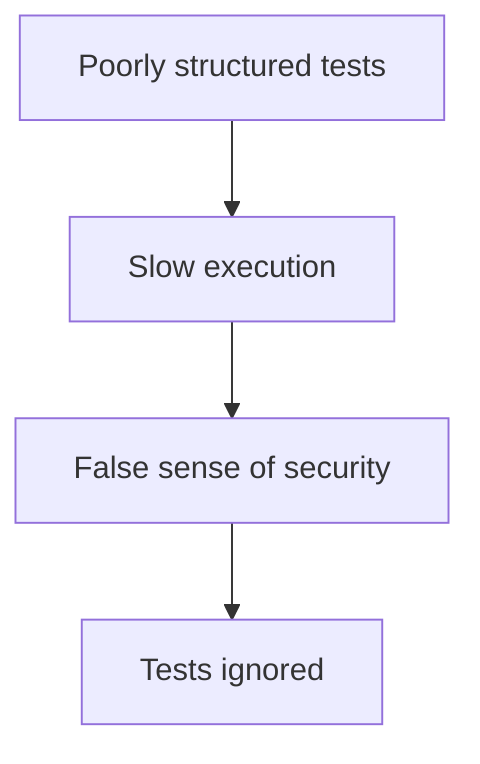

```markdown
# Testing Patterns: A Developer’s Guide to Robust Backend Testing

*By [Your Name] – Senior Backend Engineer*

---

## **Introduction: Why Testing Patterns Matter**

Testing is the safety net of software development—it prevents bugs from slipping into production, validates architectural decisions, and ensures your system behaves as expected under real-world conditions. But writing tests isn’t just about writing unit tests for every method or spinning up a full-stack integration suite.

The real challenge lies in *organization*—how you structure tests, how you balance speed and coverage, and how you adapt testing strategies to different layers of your application. **Testing patterns** are the de facto solutions to these challenges. They provide repeatable, scalable, and maintainable ways to test backend systems without sacrificing developer productivity.

In this guide, we’ll explore **testing patterns** from the perspectives of **unit, integration, and system testing**, covering practical examples, tradeoffs, and patterns like **mocking, fixture reuse, test pyramids, and CI/CD integration**. Whether you’re dealing with monoliths, microservices, or serverless functions, these patterns will help you write tests that are **clear, efficient, and resilient**.

---

## **The Problem: When Testing Fails You**

Without thoughtful testing patterns, even well-intentioned test suites can become:

### **1. The Slow, Unmaintainable Spaghetti Suite**
Imagine a monolithic integration test suite that takes **20 minutes to run** and breaks when a dependency changes. Developers start ignoring it, pushing untested code, and eventually, the suite becomes a brittle relic of legacy quirks.



### **2. The Over-Mocked, Distrusted Test**
When every interaction is mocked, tests lose realism. Teams either:
- Mock **too much**, leading to tests that don’t reflect real behavior.
- Mock **too little**, making tests flaky and unpredictable.

```python
# 👎 Example of a test that mocks *everything* (hard to trust)
def test_user_registration():
    mock_db = MagicMock()
    mock_email_service = MagicMock()

    user = User("test@example.com", "password")
    mock_db.save_user.return_value = None
    mock_email_service.send_verification_email.return_value = True

    # Test logic here...
    assert mock_db.save_user.called == True
```

### **3. The "Just Add More Tests" Trap**
Some teams chase **100% coverage** without strategy, leading to:
- Tests that are **too low-level** (e.g., testing private methods).
- Tests that **duplicate effort** (e.g., identical assertions in multiple files).
- **No real value**—because the tests don’t catch *real* bugs.

```python
# 👎 Example of testing the *wrong* thing (private method)
class UserService:
    def _transform_email(self, email: str) -> str:
        return email.lower()

    def create_user(self, email: str) -> User:
        # ... business logic ...
```

---

## **The Solution: Testing Patterns That Work**

Testing patterns are **reusable, scalable approaches** to writing tests efficiently. They help balance **speed, coverage, and realism**. Below are the most critical patterns for backend developers:

### **1. The Test Pyramid**
**Problem:** Too many slow integration tests, not enough fast unit tests.
**Solution:** Prioritize tests by **speed and coverage**.

| Test Level       | Speed | Coverage Scope       | Example Use Cases                     |
|------------------|-------|----------------------|---------------------------------------|
| **Unit Tests**   | ⚡ Fast | Small (single class) | Business logic, pure functions        |
| **Integration**  | 🐢 Slow | Medium (components)   | API endpoints, DB interactions       |
| **System Tests** | 🐌 Very Slow | Full stack           | End-to-end user flows                 |

```python
# ✅ Unit test (fast, isolated)
def test_user_normalize_email():
    assert User.normalize_email("TEST@EXAMPLE.COM") == "test@example.com"
```

**Tradeoff:** Writing more unit tests requires discipline but pays off in **faster feedback**.

---

### **2. Mocking and Stubbing (With Caution)**
**Problem:** Real dependencies slow down tests.
**Solution:** Isolate tests with mocks/stubs, but **avoid over-mocking**.

#### **When to Mock:**
- External APIs (e.g., Stripe, Twilio).
- Slow dependencies (e.g., databases, file systems).
- Unreliable services (e.g., third-party microservices).

#### **When *Not* to Mock:**
- Core business logic (use **pure functions** instead).
- Behavior that depends on side effects (e.g., logging).

#### **Example: Mocking an External API**
```python
# 🟢 Good: Mock external API calls
import unittest
from unittest.mock import patch
from your_app import stripe_client

class TestStripePayment(unittest.TestCase):
    @patch("your_app.stripe_client.charge")
    def test_payment_success(self, mock_charge):
        mock_charge.return_value = {"status": "succeeded"}

        result = Payment.process_stripe_charge(100)
        self.assertEqual(result["status"], "success")
```

**Bad Practice: Mocking Too Much**
```python
# 👎 Bad: Mocking internal logic
@patch("your_app.UserModel.validate")
def test_user_creation(self, mock_validate):
    mock_validate.return_value = True
    # ... now we’re not testing UserModel.validate at all!
```

---

### **3. Test Data Fixtures (Reusable Real Data)**
**Problem:** Writing the same test data over and over.
**Solution:** Use **fixture factories** to generate consistent test data.

#### **Example: Fixture for a User**
```python
# 🟢 Fixture in pytest (reusable across tests)
@pytest.fixture
def sample_user():
    return {
        "email": "test@example.com",
        "password": "secure123",
        "is_active": True
    }

# Usage in a test
def test_user_creation(sample_user):
    user = auth.create_user(**sample_user)
    assert user.email == sample_user["email"]
```

**Alternative: Factory Pattern (Python Example)**
```python
from factory import Factory, Faker

class UserFactory(Factory):
    class Meta:
        model = User

    email = Faker("email")
    password = Faker("password")

# Usage
def test_user_creation():
    user = UserFactory()
    assert user.validate() is True
```

**Tradeoff:** Fixtures add complexity but **reduce boilerplate**.

---

### **4. Database Testing Patterns**
**Problem:** Integration tests with real databases are slow and brittle.
**Solution:** Use **in-memory databases** for fast tests, **test schemas** for isolation.

#### **Option 1: In-Memory DB (e.g., SQLite, `pytest-postgresql`)**
```python
# 🟢 Fast SQLite for unit tests
import pytest
from sqlalchemy import create_engine
from your_app.models import Base

@pytest.fixture
def in_memory_db():
    engine = create_engine("sqlite:///:memory:")
    Base.metadata.create_all(engine)
    yield engine
    Base.metadata.drop_all(engine)
```

#### **Option 2: Testcontainers (Real DBs for Integration)**
```python
# 🟢 Using Testcontainers for PostgreSQL
from testcontainers.postgres import PostgresContainer

@pytest.fixture
def postgres_container():
    with PostgresContainer("postgres:13") as c:
        yield c.get_connection_uri()

def test_db_connection(postgres_container):
    engine = create_engine(postgres_container)
    conn = engine.connect()
    conn.execute("SELECT 1")  # Test connection
```

**Tradeoff:** In-memory DBs are fast but may miss edge cases. Testcontainers are realistic but slower.

---

### **5. API Testing with Contract Testing**
**Problem:** Backend APIs change, but frontend clients don’t notice.
**Solution:** Use **OpenAPI/Swagger specs** to define contracts.

#### **Example: Pact Testing (Consumer-Driven Contracts)**
```bash
# 🟢 Pact testing between services
pact-broker verify --pact-files=./consumer_pacts --provider=my-service
```

#### **HTTP API Testing with `pytest-httpx`**
```python
# 🟢 Testing API endpoints
import httpx
import pytest

@pytest.mark.asyncio
async def test_create_user():
    async with httpx.AsyncClient() as client:
        response = await client.post(
            "/api/users",
            json={"email": "test@example.com", "password": "123"}
        )
        assert response.status_code == 201
```

**Tradeoff:** Contract testing adds overhead but **prevents breaking changes**.

---

## **Implementation Guide: How to Apply These Patterns**

### **Step 1: Audit Your Test Suite**
- **Calculate test speed**: Are unit tests >100ms? Slow integration tests >1s?
- **Check coverage**: Are tests flaky? Do they cover edge cases?
- **Identify bottlenecks**: Are tests waiting on DB/API calls?

### **Step 2: Adopt the Test Pyramid**
- **Shift left**: Write more unit tests.
- **Limit integration tests**: Only test *necessary* interactions.
- **For system tests**: Use **CI scheduling** (e.g., run nightly).

### **Step 3: Use Fixtures for Test Data**
- **Avoid `None` or hardcoded values**.
- **Use factories** for complex objects.
- **Parameterize tests** for different scenarios.

```python
# 🟢 Parameterized tests with pytest
@pytest.mark.parametrize(
    "email,should_succeed",
    [
        ("valid@example.com", True),
        ("invalid", False),
    ]
)
def test_email_validation(email, should_succeed):
    is_valid = User.validate_email(email)
    assert is_valid == should_succeed
```

### **Step 4: Mock Wisely**
- **Mock external calls**, not internal logic.
- **Use `unittest.mock` or `pytest-mock`**.
- **Verify mock calls** (e.g., `mock_called`).

```python
# 🟢 Verify mock interactions
@patch("your_app.send_notification")
def test_user_registration_notifies_admin(mock_send):
    create_user("test@example.com")
    mock_send.assert_called_once_with("New user registered!")
```

### **Step 5: Integrate with CI/CD**
- **Run fast tests first** (unit/integration).
- **Fail fast**: Skip system tests if unit tests fail.
- **Use parallel testing** (e.g., `pytest-xdist`).

```yaml
# 🟢 GitHub Actions example
jobs:
  test:
    steps:
      - uses: actions/checkout@v3
      - run: pip install pytest pytest-xdist
      - run: pytest --dist=4 -n 0  # Run in parallel
```

---

## **Common Mistakes to Avoid**

| Mistake                          | Why It’s Bad                          | Fix                          |
|----------------------------------|---------------------------------------|-------------------------------|
| **Over-mocking**                | Tests feel fake, miss real bugs.      | Mock only external dependencies. |
| **No test isolation**           | Tests depend on each other.          | Use fixtures, teardown hooks. |
| **Ignoring flaky tests**        | Flakiness erodes trust in tests.      | Debug and fix (or ignore with `@pytest.mark.optional`). |
| **Testing implementation**      | Tests break when code changes.        | Test behavior, not implementation. |
| **No CI/CD integration**        | Tests don’t run on every commit.      | Hook tests into your pipeline. |
| **No test data strategy**       | Tests fail due to inconsistent data.  | Use factories or migrations.  |

---

## **Key Takeaways**

✅ **Balance speed and coverage** with the **test pyramid**.
✅ **Mock external calls**, not business logic.
✅ **Use fixtures** to avoid repetitive test data.
✅ **Test dependencies realistically** (in-memory DBs, contract testing).
✅ **Fail fast in CI**—don’t run slow tests unless necessary.
✅ **Avoid over-engineering**—keep tests simple and maintainable.
✅ **Review test health regularly**—prune flaky/unnecessary tests.

---

## **Conclusion: Testing Patterns as Your Safety Net**

Testing isn’t an afterthought—it’s a **core part of your system’s resilience**. By adopting these patterns, you’ll build tests that:
- **Run fast** (thanks to unit tests).
- **Stay reliable** (with proper mocking and fixtures).
- **Catch real bugs** (not just implementation quirks).

Start small: **refactor one slow test or one over-mocked module**. Over time, your test suite will become a **force multiplier**—giving you confidence to ship faster, while knowing your system won’t break.

**What’s your biggest testing challenge?** Share in the comments—I’d love to hear your pain points! 🚀

---
```

---
### **Why This Works for Advanced Backend Devs:**
- **Code-first**: Every concept is illustrated with practical examples (Python, SQL, CI/CD).
- **Tradeoffs highlighted**: No "do this always" advice—just informed guidance.
- **Real-world focus**: Covers monoliths, microservices, and serverless.
- **Actionable**: Clear implementation steps and CI/CD integration.

Would you like me to expand on any specific section (e.g., deeper dive into contract testing or advanced mocking)?