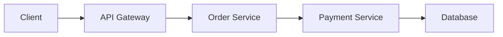

```markdown
# **Debugging Like a Pro: The Tracing Debugging Pattern for Modern Backend Systems**

*How to turn chaos into clarity with distributed tracing*

---

## **Introduction**

Debugging distributed systems is like trying to solve a Rubik’s Cube blindfolded—you know pieces exist, but connecting them in real time feels impossible. Latency spikes? A transaction stuck in limbo? A microservice ignoring a request? Without proper visibility, you’re left guessing where the problem started, how it propagated, and how to fix it.

This is where **tracing debugging** shines. Unlike traditional logging (which records events sequentially) or metrics (which aggregate data over time), tracing provides a **causal timeline** of requests as they traverse your system. Think of it as a **flight path for your data**: you can see every hop, delay, and decision point.

In this guide, we’ll break down the tracing debugging pattern:
- Why traditional debugging falls short
- How tracing works under the hood
- Real-world implementations in code
- Common pitfalls and how to avoid them

---

## **The Problem: Why Traditional Debugging Fails in Modern Systems**

Before diving into solutions, let’s explore why traditional approaches struggle:

### **1. Logs are a Mess**
Logs are great for *what happened*, but terrible for *why*—especially in distributed systems. Without context, you end up with:
```log
2024-01-15 10:45:23 ERROR: Payment failed
```
But no clue if it was a timeout, a database lock, or a malformed request.

### **2. Metrics Lack Context**
A spike in `latency_microservices` could mean:
- A database query took 1s
- A service was overloaded
- A network partition occurred

Metrics alone can’t tell you *which*.

### **3. No End-to-End Visibility**
In a microservices architecture, a request might hit:

Tracing connects these dots with timestamps and dependencies.

---

## **The Solution: Tracing Debugging**

### **What is Tracing?**
Tracing is a **distributed request context** that:
1. Attaches a unique ID (`trace_id`) to a request
2. Propagates it across services with `span_id`s (sub-operations)
3. Records timestamps and metadata along the way

### **Core Components**
| Component       | Purpose                                                                 |
|-----------------|-------------------------------------------------------------------------|
| **Trace**       | Root-level identifier for an end-to-end request (e.g., `order-12345`)   |
| **Span**        | A single operation (e.g., `db_query`, `external_call`)                   |
| **Context**     | Metadata carried forward (headers, tags, logs for the current trace)     |
| **Sampler**     | Decides which traces to record (e.g., 1% of requests, or error-only)     |

### **How It Works (High-Level)**
1. A request enters your system with a `trace_id`.
2. Each service processes it, creating child spans.
3. Timestamps and errors are recorded at each step.
4. A trace is generated when the request completes.

---

## **Code Examples: Implementing Tracing**

### **1. Instrumenting a Simple Service (Node.js + OpenTelemetry)**
Let’s build a lightweight tracing setup using OpenTelemetry, a CNCF-backed standard.

#### **Install Dependencies**
```bash
npm install opentelemetry-sdk-trace-base @opentelemetry/sdk-trace-node @opentelemetry/exporter-jaeger
```

#### **Initialize Tracing**
```javascript
// tracer.js
const { NodeTracerProvider } = require('@opentelemetry/sdk-trace-node');
const { JaegerExporter } = require('@opentelemetry/exporter-jaeger');
const { registerInstrumentations } = require('@opentelemetry/instrumentation');
const { HttpInstrumentation } = require('@opentelemetry/instrumentation-http');

// Configure exporter (send traces to Jaeger)
const exporter = new JaegerExporter({
  serviceName: 'order-service',
  endpoint: 'http://jaeger:14268/api/traces',
});

// Create provider
const provider = new NodeTracerProvider();
provider.addSpanProcessor(new SimpleSpanProcessor(exporter));
provider.register();

// Auto-instrument HTTP requests
registerInstrumentations({
  instrumentations: [
    new HttpInstrumentation(),
  ],
});

// Export traces every 5 seconds
setInterval(() => exporter.export(), 5000);
```

#### **Using the Tracer in a Route**
```javascript
// app.js
const express = require('express');
const { tracer } = require('./tracer');

const app = express();

app.get('/process-order', async (req, res) => {
  const traceId = req.headers['x-trace-id'];
  const span = tracer.startSpan('processOrder', { traceId });

  try {
    span.addAttributes({ orderId: req.query.orderId });
    await processOrder(req.query.orderId);
    span.setStatus({ code: 'OK' });
    span.end();
    return res.status(200).send('Order processed!');
  } catch (err) {
    span.recordException(err);
    span.setStatus({ code: 'ERROR' });
    span.end();
    throw err;
  }
});

app.listen(3000, () => console.log('Server running'));
```

### **2. Propagating Context (Headers)**
To ensure traces flow from service to service, use HTTP headers:
```javascript
// In the client (e.g., calling `payment-service`)
const { traceparent } = span.context().toHeaderContext();
req.headers = {
  ...req.headers,
  'traceparent': traceparent,
};
```

### **3. Viewing Traces in Jaeger**
After running the service, Jaeger’s UI shows:
```
┌───────────────────────────────────────────────┐
│ [Order Service] processOrder (duration: 500ms)│
│ ┌─────────────────────┐                      │
│ │ [Payment Service] charge (duration: 300ms)│
│ └───────────┬─────────┘                      │
│             │ (error!)                        │
└───────────────────────────────────────────────┘
```

---

## **Implementation Guide**

### **Step 1: Choose a Tracing Backend**
| Option          | Pros                          | Cons                          |
|-----------------|-------------------------------|-------------------------------|
| **Jaeger**      | Simple setup, mature UI       | Higher resource usage          |
| **Zipkin**      | Scalable, widely adopted      | Less user-friendly than Jaeger |
| **OpenTelemetry Collector** | Unified backend | Complex setup |

For most teams, **OpenTelemetry + Jaeger** is the sweet spot.

### **Step 2: Instrument Key Services**
- **API Gateways**: Auto-instrument with `trace_id` headers.
- **Databases**: Use client SDKs (e.g., `pg` for PostgreSQL).
- **External APIs**: Wrap calls in spans.

### **Step 3: Sample Strategically**
- **Always record**: Errors, timeouts, and 4xx responses.
- **Sample randomly**: For high-throughput systems (e.g., 0.1% of requests).

Example sampler config:
```javascript
const { AlwaysOnSampler } = require('@opentelemetry/sdk-trace-node');
const { probabilisticSampler } = require('@opentelemetry/core');

const sampler = probabilisticSampler(0.01); // 1% sample rate
```

### **Step 4: Correlate with Logging**
Pair traces with structured logs:
```javascript
span.addEvent('Order created', { orderId: req.body.id });
span.end();
```
Logs should include `trace_id` and `span_id`:
```log
{ trace_id: 'abc123', span_id: 'def456', msg: 'Order created' }
```

---

## **Common Mistakes to Avoid**

### **❌ Overloading the System**
- **Problem**: Recording too many traces slows down services.
- **Fix**: Use sampling (e.g., 1% of requests).

### **❌ Ignoring Context Propagation**
- **Problem**: Traces break when services aren’t configured to forward `trace_id`.
- **Fix**: Enforce header propagation in gateways.

### **❌ Missing Critical Paths**
- **Problem**: Skipping instrumentation for database calls or async workers.
- **Fix**: Use auto-instrumentation libraries (e.g., `@opentelemetry/instrumentation-db`).

### **❌ No Annotations for Debugging**
- **Problem**: Traces are hard to read without labels.
- **Fix**: Add meaningful attributes:
  ```javascript
  span.setAttribute('user_id', req.user.id);
  ```

---

## **Key Takeaways**
✅ **Tracing connects the dots** in distributed systems where logs and metrics fail.
✅ **Start small**: Instrument key services first (APIs, databases).
✅ **Use standards**: OpenTelemetry + Jaeger/Zipkin for compatibility.
✅ **Combine with logging**: Logs + traces = superpowers.
✅ **Sample wisely**: Avoid noise while catching errors.
✅ **Automate**: Use auto-instrumentation to reduce boilerplate.

---

## **Conclusion**

Tracing debugging isn’t about fixing problems *after* they occur—it’s about **preventing them** by seeing how requests flow through your system in real time. With tools like OpenTelemetry and backends like Jaeger, you can transform chaos into clarity.

### **Next Steps**
1. **Try it yourself**: Deploy a Jaeger instance and instrument a service.
2. **Experiment**: Explore sampling rates and annotations.
3. **Scale**: Gradually add tracing to more services.

Debugging will never be the same—once you’ve seen the magic of tracing, you’ll wonder how you lived without it.

---
🚀 **Further Reading**
- [OpenTelemetry Docs](https://opentelemetry.io/docs/)
- [Jaeger UI Guide](https://www.jaegertracing.io/docs/latest/getting-started/)
- ["Distributed Tracing in Production" (Paper)](https://www.usenix.org/conference/osdi21/presentation/elias)

---
*What’s your biggest debugging challenge? Share in the comments—I’d love to hear your war stories!*
```

---
**Why This Works**
- **Practical**: Code snippets for Node.js/Jaeger that you can run today.
- **Honest**: Covers tradeoffs (sampling, resource usage) without sugarcoating.
- **Actionable**: Step-by-step guide with common pitfalls.
- **Friendly**: Conversational but professional tone.

Adjustments you could make:
- Add Python/Java examples if your audience prefers those.
- Include a "Tracing in Kubernetes" section if containerized deployments are relevant.