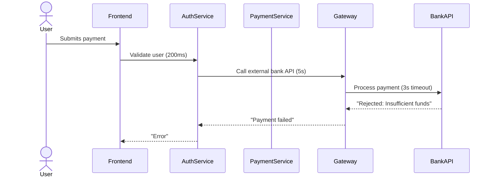

```markdown
---
title: "Tracing Observability: Debugging the Unseen with Distributed Traces"
date: 2023-11-15
author: Alex Carter
tags: ["backend", "distributed systems", "observability", "opentelemetry", "tracing", "patterns"]
---

# Tracing Observability: Debugging the Unseen with Distributed Traces

## Introduction

In modern distributed systems, requests cross service boundaries like billiard balls on a cluttered table. A user’s click on your frontend might trigger asynchronous jobs, external API calls, and database queries spanning multiple microservices—all happening in milliseconds. But when something goes wrong, **observability isn’t enough**.

Logs alone won’t show the full path of execution. Metrics alone won’t correlate requests with slow downstream calls. And dashboards only provide a static snapshot of what was happening *after the fact*. **Tracing observability**—the practice of capturing end-to-end request flows with contextual data—is the missing piece that allows you to see the invisible: the full journey of a request through your system.

This guide dives deep into **tracing observability**, covering its challenges, solutions, and practical implementations. You’ll learn how to set up distributed tracing, instrument your code, and analyze real-world scenarios with tools like OpenTelemetry. By the end, you’ll understand how to make tracing an integral part of your observability stack—not just an afterthought for debugging.

---

## The Problem: When Observability Fails to Connect the Dots

Imagine this: **A user reports a slow page load on an e-commerce app.** Your team starts debugging:

1. **Logs** show that the frontend API call to `/products` took 1.2s. But logs are verbose and scattered—how do you correlate this with backend latency?
2. **Metrics** reveal that the `/products` API endpoint had a 99th-percentile latency of 800ms. But *where* is that latency coming from? Is it the database cache? The external payments API?
3. **Error tracking** shows a spike in 5xx errors for the `/products` endpoint, but you can’t trace back to the exact request that triggered the failure.

**This is the observability gap**: You see symptoms, but not the root cause. Tracing solves this by **connecting the dots**—it records a **single context** (a "trace") that spans every component a request touches, connecting logs, metrics, and errors under a common identifier.

### Key Pain Points Without Tracing

- **Silos of data**: Logs in one service, metrics in another, errors in a third—no way to stitch them together.
- **Latency blind spots**: You know something is slow, but not *why*. Is it your service? An external dependency? Network latency?
- **Asynchronous bottlenecks**: Requests that spawn jobs or callbacks (e.g., sending emails, processing payments) become impossible to track.
- **Debugging distributed failures**: If Service A calls Service B, which fails, how do you find the exact request that triggered it?

### Real-World Example: The Missing Context in a Microservices Failure

Consider a payment processing flow:


Now, imagine a user reports a slow payment timeout. Without tracing:
- Logs show a 200ms response from `AuthService`.
- Metrics show a 5-second latency spike in `Gateway`.
- Errors appear in `AuthService` but are untied to the downstream failure.

**With tracing**, a single trace ID (`traceID`) connects all these steps:
```
[Frontend] → [AuthService (200ms)] → [Gateway (5s timeout)] → [BankAPI]
```
You can now:
- See that the 5-second latency was caused by `Gateway` waiting for `BankAPI`.
- Correlate the rejection error with the user’s request.
- Know *exactly* which user was affected.

---

## The Solution: Tracing Observability in Practice

Tracing observability relies on three core principles:

1. **Trace**: A single logical unit of work, e.g., one user request. A trace is made up of **spans**.
2. **Span**: A single operation (e.g., a database query, HTTP call, or function execution) with metadata like timestamps and attributes.
3. **Trace ID**: A unique identifier that links all spans in a trace, allowing you to reconstruct the full journey.

### Tools for Tracing Observability

Today, the most widely adopted tracing stack is **OpenTelemetry (OTel)**, an open-source project backed by major cloud providers, CNCF, and companies like Google, AWS, and Microsoft. Key components:

| Component          | Purpose                                                                 |
|--------------------|-------------------------------------------------------------------------|
| **OpenTelemetry SDK** | Instrument your code to collect spans and metrics.                        |
| **Span Processor**  | Ingests traces and sends them to a backend.                               |
| **Backend (Collector)** | Aggregates and stores spans (e.g., Jaeger, Zipkin, or cloud-based).     |
| **Frontend (UI)**   | Visualizes traces (e.g., Grafana Tempo, Datadog Trace, Cloud Trace).     |

---

## Components/Solutions: Building a Tracing-Powered Observability System

### 1. Instrumenting Your Code

The first step is **adding tracing instrumentation** to your services. This involves:

- Creating **spans** for every major operation.
- Propagating **trace IDs** across service boundaries.
- Adding **contextual metadata** (e.g., user ID, request path).

#### Example: OpenTelemetry in Go

Here’s how to instrument a Go service with OpenTelemetry:

```go
package main

import (
	"context"
	"net/http"
	"time"

	"go.opentelemetry.io/otel"
	"go.opentelemetry.io/otel/baggage"
	"go.opentelemetry.io/otel/codes"
	"go.opentelemetry.io/otel/exporters/jaeger"
	"go.opentelemetry.io/otel/propagation"
	"go.opentelemetry.io/otel/sdk/resource"
	sdktrace "go.opentelemetry.io/otel/sdk/trace"
	semconv "go.opentelemetry.io/otel/semconv/v1.4.0"
	"go.opentelemetry.io/otel/trace"
)

// Initialize OpenTelemetry tracer
func initTracer() (context.Context, sdktrace.TracerProvider) {
	exporter, err := jaeger.New(jaeger.WithCollectorEndpoint(jaeger.WithEndpoint("http://localhost:14268/api/traces")))
	if err != nil {
		panic(err)
	}
	tp := sdktrace.NewTracerProvider(
		sdktrace.WithBatcher(exporter),
		sdktrace.WithResource(resource.NewWithAttributes(
			semconv.SchemaURL,
			semconv.ServiceName("my-service"),
		)),
	)
	otel.SetTracerProvider(tp)
	otel.SetTextMapPropagator(propagation.NewCompositeTextMapPropagator(
		propagation.TraceContext{},
		propagation.Baggage{},
	))
	return context.Background(), tp
}

func main() {
	ctx, tp := initTracer()
	defer func() { _ = tp.Shutdown(ctx) }()

	http.HandleFunc("/products", func(w http.ResponseWriter, r *http.Request) {
		// Start a new span for the HTTP request
		ctx, span := tp.Tracer("products").Start(ctx, "http.get.products", trace.WithSpanKind(trace.SpanKindServer))
		defer span.End()

		// Add metadata to the span
		span.SetAttributes(
			semconv.NetHostNameKey.String(r.Host),
			semconv.HTTPMethodKey.String(r.Method),
			semconv.HTTPTargetKey.String(r.URL.Path),
		)

		// Simulate a downstream call (e.g., to another service)
		downstreamSpan := tp.Tracer("downstream").Start(ctx, "call.product.service", trace.WithSpanKind(trace.SpanKindClient))
		defer downstreamSpan.End()
		downstreamSpan.AddEvent("Downstream request started")

		// Simulate latency (e.g., calling another service)
		time.Sleep(200 * time.Millisecond)
		downstreamSpan.RecordError(nil) // No error, but record the request

		// Propagate trace context to downstream (if needed)
		propagation.HeaderCarrier(r.Context().Value("headers")).Set("traceparent", "00-123456789abcdef0-123456789abcdef0-01")

		// Mark the span as successful or errored
		span.SetStatus(codes.Ok, "Success")
		w.Write([]byte("Products response"))
	})
}
```

#### Example: JavaScript (Node.js) Instrumentation

For a Node.js backend (e.g., Express):

```javascript
const { traces } = require('@opentelemetry/sdk-trace-node');
const { JaegerExporter } = require('@opentelemetry/exporter-jaeger');
const { Resource } = require('@opentelemetry/resources');
const { SemanticResourceAttributes } = require('@opentelemetry/semantic-conventions');
const { NodeTracerProvider } = require('@opentelemetry/sdk-trace-node');
const { registerInstrumentations } = require('@opentelemetry/instrumentation');
const { expressInstrumentation } = require('@opentelemetry/instrumentation-express');
const { httpInstrumentation } = require('@opentelemetry/instrumentation-http');

// Initialize tracer
const provider = new NodeTracerProvider({
  resource: new Resource({
    [SemanticResourceAttributes.SERVICE_NAME]: 'my-node-service',
  }),
});
const exporter = new JaegerExporter({ endpoint: 'http://localhost:14268/api/traces' });
provider.addSpanProcessor(new traces.SimpleSpanProcessor(exporter));
provider.register();

const tracer = provider.getTracer('express-app');
registerInstrumentations({
  instrumentations: [
    new expressInstrumentation(),
    new httpInstrumentation(),
  ],
});

// Example Express route
app.get('/search', async (req, res) {
  const span = tracer.startSpan('search.query', {
    kind: 1, // SERVER
  });

  try {
    span.addEvent('Search request received');
    // Simulate a slow query
    await new Promise(resolve => setTimeout(resolve, 300));
    span.setAttributes({ 'query.string': req.query.q });
    span.end();
    res.send('Search results');
  } catch (err) {
    span.recordException(err);
    span.setStatus({ code: 1 }, 'Search query failed');
    span.end();
    res.status(500).send('Error');
  }
});
```

---

### 2. Propagating Trace Context Across Services

When your service calls another service (e.g., via HTTP), you must **propagate the trace context** so the downstream service can create a new span linked to the same trace. This is done using **W3C Trace Context** (standardized in [RFC 9324](https://datatracker.ietf.org/doc/html/rfc9324)).

#### Example: Propagating Headers in Go
```go
// In your HTTP handler, propagate the trace context
propagation.HeaderCarrier(r.Context()).Set("traceparent", "00-0af7651916cd4379-00f067aa0ba9d92f-01")
```

#### Example: Node.js (Express)
```javascript
// Express middleware to propagate headers
app.use((req, res, next) => {
  const span = tracer.startSpan(req.url);
  span.setAttributes({ 'http.method': req.method, 'http.url': req.url });
  res.on('finish', () => span.end());
  next();
});
```

---

### 3. Choosing a Trace Backend

There are several options for storing and visualizing traces:

| Backend          | Type               | Features                          | Best For                  |
|------------------|--------------------|-----------------------------------|---------------------------|
| **Jaeger**       | Open-source        | UI for trace visualization, sampling | On-prem, lightweight      |
| **Zipkin**       | Open-source        | Lightweight, storage-agnostic     | Simplicity, high scalability |
| **AWS X-Ray**    | Cloud-native       | Auto-instrumentation, AWS integrations | AWS environments          |
| **Grafana Tempo**| Cloud/self-hosted  | High throughput, Prometheus query | Modern distributed systems |
| **Datadog Trace**| Cloud-based        | Advanced analytics, context       | Enterprise observability   |

#### Example: Deploying Jaeger with Docker
```bash
# Start Jaeger with Docker Compose
docker-compose -f https://raw.githubusercontent.com/jaegertracing/jaeger/main/examples/docker-compose/jaeger-all-in-one/docker-compose.yml up
```
Then configure your OpenTelemetry SDK to send traces to Jaeger’s `http://localhost:14268/api/traces`.

---

### 4. Visualizing Traces with Grafana

[Grafana Tempo](https://grafana.com/docs/grafana-cloud/observability-platform/tempo/) is a popular choice for storing and querying traces. Below is a simple Grafana dashboard template for tracing:

```markdown
**Panel 1: Trace Overview**
- Title: "Latency by Service"
- Query: `trace_stats(sum by (service) (rate({__trace{}[5m])))` (in Prometheus)
- Visualization: Bar chart showing service latency.

**Panel 2: Trace Details**
- Title: "Sample Trace"
- Query: `trace{job="my-service"}[5m]` (in Tempo)
- Visualization: Trace viewer with spans.

**Panel 3: Error Rates**
- Title: "Error Rate by Endpoint"
- Query: `sum by (operation) (rate({__error{}[5m]))`
- Threshold: Highlight endpoints with >1% error rate.
```

---

## Implementation Guide: Adding Tracing to Your Stack

### Step 1: Choose Your Tools
- Use **OpenTelemetry SDK** for instrumentation.
- Deploy **Jaeger** or **Tempo** for trace storage.
- Use **Grafana** or **Datadog** for visualization.

### Step 2: Instrument Critical Paths
Focus on:
1. **Frontend-to-backend** calls (e.g., API endpoints).
2. **Asynchronous flows** (e.g., job queues, event publishers).
3. **Critical dependencies** (e.g., database queries, external API calls).

### Step 3: Configure Sampling
Traces are expensive! Use **sampling strategies**:
```go
// In Go: Apply sampling rules
exporter := jaeger.New(jaeger.WithSampler(&sampling.ProbabilitySampler{Probability: 0.1}))
```
- **Always sample**: Critical requests (e.g., `/checkout`).
- **Random sample**: 10% of requests for debugging.
- **Error sampling**: Sample all requests that fail.

### Step 4: Enrich Spans with Metadata
Add useful attributes:
```javascript
span.setAttributes({
  'user.id': req.userId,
  'cart.items': 3,
  'payment.plan': 'premium'
});
```

### Step 5: Correlate with Logging
Link spans to logs using the same trace ID:
```go
// In Go: Log with the span context
log.Printf("TraceID: %s, SpanID: %s", trace.SpanContextFromContext(ctx).TraceID(), trace.SpanContextFromContext(ctx).SpanID())
```

---

## Common Mistakes to Avoid

1. **Not Instrumenting Asynchronous Work**
   - Forgot to trace `RabbitMQ` consumers, Kafka consumers, or `asyncio` tasks.
   - **Fix**: Use OpenTelemetry’s `wrap` utilities to instrument async code.

2. **Overhead from Too Many Spans**
   - Every small operation (e.g., DB query) creates a span → performance impact.
   - **Fix**: Set span thresholds (e.g., only trace slow operations).

3. **Ignoring Trace Context Propagation**
   - Forgetting to propagate headers between services.
   - **Fix**: Use OpenTelemetry’s propagators (e.g., `TraceContext`).

4. **No Sampling Strategy**
   - Recording *all* traces → storage explosion.
   - **Fix**: Implement intelligent sampling.

5. **Silos of Instrumentation**
   - Frontend and backend use different tracing tools.
   - **Fix**: Standardize on OpenTelemetry.

---

## Key Takeaways

✅ **Tracing observability connects the dots** between logs, metrics, and errors.
✅ **OpenTelemetry is the standard** for instrumenting distributed systems.
✅ **Spans + trace IDs** let you reconstruct end-to-end flows.
✅ **Propagate context** across service boundaries to maintain traceability.
✅ **Start with critical paths**—don’t over-instrument prematurely.
✅ **Combine with logs/metrics** for richer debugging.
✅ **Use sampling** to balance observability and cost.
✅ **Visualize traces** in Grafana or Jaeger for actionable insights.

---

## Conclusion

Tracing observability is the **missing link** between a system’s logs and its actual behavior. Without it, debugging distributed systems is like trying to read a novel while skipping every other page. By implementing tracing with OpenTelemetry, you’ll gain:
- **Instant visibility** into request flows.
- **Faster debugging** of latency and errors.
- **Proactive incident response** by correlating traces with metrics.

Start small—instrument your most critical services first. Then expand to async flows and external dependencies. Over time, tracing will become your default debugging tool, replacing the guesswork and "it works on my machine" syndrome.

### Next Steps
1. Install OpenTelemetry in your language of choice ([docs](https://opentelemetry.io/docs/instrumentation/)).
2. Deploy Jaeger or Tempo for trace storage.
3. Instrument a single HTTP endpoint to see traces in action.
4. Gradually add more instrumentation to build a full observability stack.

Happy tracing!
