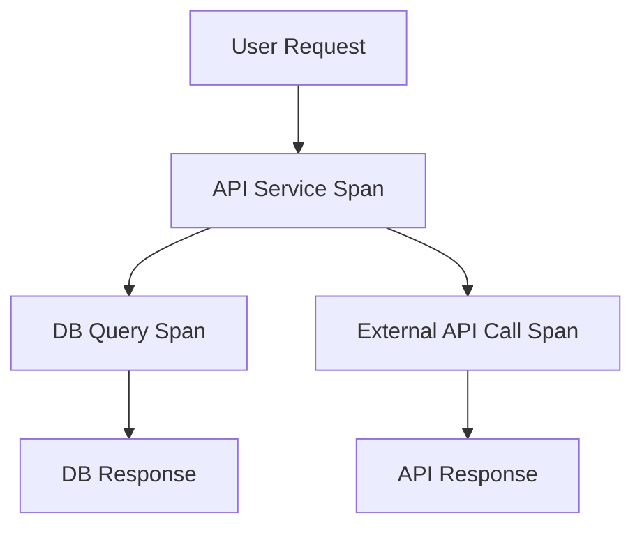

```markdown
# **"Distributed Tracing Unlocked: The Observability Pattern for Beginners"**

*How to Debug Real-World APIs Like a Pro (Without Pulling Your Hair Out)*

---

## **Introduction**

Imagine this: Your users report that a critical feature—like checkout on an e-commerce site—is suddenly failing. The error logs say *"500 Server Error,"* but you don’t know *where* or *why*. Maybe it’s a slow database query? A misconfigured microservice dependency? A race condition in your payment processor? Without visibility into the full flow of requests across your system, troubleshooting feels like searching for a needle in a haystack.

**Enter distributed tracing.** This isn’t just logging—it’s the superpower that lets you follow the lifecycle of a single request as it bounces through services, databases, and external APIs. Tools like OpenTelemetry, Jaeger, and Zipkin make tracing accessible, but understanding *how* and *when* to implement it can still feel abstract.

In this guide, we’ll break down the **Tracing Observability Pattern**, step by step. You’ll learn:
- Why plain logs fall short (and how tracing fixes it).
- How to instrument your APIs for traceability.
- Practical code examples in Python (FastAPI) and Node.js (Express).
- Common pitfalls and how to avoid them.

By the end, you’ll be equipped to add tracing to your projects—or at least understand why your team’s traces are so valuable.

---

## **The Problem: When Logs Aren’t Enough**

Log-based observability is like reading a book where each chapter was written by a different author. Here’s what happens when you rely *only* on logging in a distributed system:

### **1. Correlation is a Guesswork**
Without a shared context, logs from multiple services are like disconnected clues:
- Service A logs: *"Failed to fetch user data from DB (Error: 500)"*
- Service B logs: *"Wrote order to database, but missing user ID."*
- Service C logs: *"Payment failed—no user context available."*

*All you know is something broke. You don’t know the full sequence.*

### **2. Performance Bottlenecks Hide**
Logs might show a slow endpoint, but do you know:
- Was it a slow database query?
- A network timeout to an external API?
- Or just a poorly optimized function?

Without tracing, you’re flying blind.

### **3. Latency is a Black Box**
A user complains: *"My order took 10 seconds to process!"*
Your team’s response: *"We didn’t know it was slow."*
Because logs are static—you can’t easily reconstruct the *full path* of that request.

---

## **The Solution: Distributed Tracing**

Tracing solves these problems by:
- **Injecting a unique trace ID** into every request, ensuring all related logs can be connected.
- **Recording timestamps** to measure end-to-end latency.
- **Tagging spans** (sub-operations) with metadata like service names, HTTP statuses, and custom fields.
- **Visualizing flows** in tools like Jaeger or Grafana, so you can see the *exact* path a user request took.

The result? **A single, continuous story** of what happened—and where it went wrong.

---

## **Components of the Tracing Observability Pattern**

### **1. Trace IDs & Spans**
- A **trace** represents the lifecycle of a single request across services.
- A **span** is a unit of work (e.g., an HTTP request, DB query, or function call).
  - Spans have:
    - A unique **trace ID** (to correlate spans).
    - A **parent/child relationship** (e.g., a request spawns a DB query).
    - **Timestamps** (start/end).
    - **Status** (success/failure).
    - **Attributes** (custom data like `user_id=123`).



### **2. Propagation Context**
To keep tracing across services, you **inject** trace IDs into HTTP headers or other transports (e.g., gRPC metadata). Most frameworks do this automatically.

### **3. Tracing Tools**
| Tool          | Role                          | Popular Libraries          |
|---------------|-------------------------------|----------------------------|
| ** Collector  | Aggregates traces             | OpenTelemetry, Jaeger      |
| ** Exporter   | Sends traces to storage       | Zipkin, Prometheus         |
| ** Visualizer | Displays trace graphs         | Jaeger UI, Grafana         |

---

## **Code Examples: Adding Tracing to Your APIs**

Let’s implement tracing in **FastAPI (Python)** and **Express (Node.js)**.

---

### **1. FastAPI + OpenTelemetry (Python)**
#### **Step 1: Install Dependencies**
```bash
pip install opentelemetry-api opentelemetry-sdk opentelemetry-exporter-otlp opentelemetry-instrumentation-fastapi opentelemetry-instrumentation-sqlalchemy
```

#### **Step 2: Initialize Tracing**
```python
# main.py
from fastapi import FastAPI
from opentelemetry import trace
from opentelemetry.sdk.trace import TracerProvider
from opentelemetry.sdk.trace.export import BatchSpanProcessor
from opentelemetry.exporter.otlp.proto.grpc.trace_exporter import OTLPSpanExporter

# Set up OpenTelemetry
trace.set_tracer_provider(TracerProvider())
exporter = OTLPSpanExporter(endpoint="http://localhost:4317")  # OTLP endpoint
trace.get_tracer_provider().add_span_processor(BatchSpanProcessor(exporter))

app = FastAPI()

@app.get("/")
async def root():
    tracer = trace.get_tracer(__name__)
    with tracer.start_as_current_span("homepage_span"):
        return {"message": "Hello, Traced World!"}

@app.get("/search")
async def search(query: str):
    tracer = trace.get_tracer(__name__)
    # Simulate a slow DB call
    with tracer.start_as_current_span("db_query_span"):
        # Mock SQL (in reality, use SQLAlchemy with instrumentation)
        query = f"SELECT * FROM products WHERE name LIKE '%{query}%'"
        return {"query": query}
```

#### **Step 3: Run a Trace Collector**
Use [Tempo](https://grafana.com/docs/tempo/latest/) (Grafana’s trace collector) for visualization:
```bash
docker run -d -p 3200:3200 -v tempo-data:/tmp/tempo grafana/tempo:latest
```
Then query traces in Jaeger UI (`http://localhost:16686`).

---

### **2. Express + OpenTelemetry (Node.js)**
#### **Step 1: Install Dependencies**
```bash
npm install @opentelemetry/api @opentelemetry/sdk-trace-base @opentelemetry/exporter-trace-otlp @opentelemetry/instrumentation-express @opentelemetry/instrumentation @opentelemetry/instrumentation-http
```

#### **Step 2: Instrument Express**
```javascript
// server.js
const express = require('express');
const { NodeTracerProvider } = require('@opentelemetry/sdk-trace-node');
const { OTLPTraceExporter } = require('@opentelemetry/exporter-trace-otlp');
const { registerInstrumentations } = require('@opentelemetry/instrumentation');
const { ExpressInstrumentation } = require('@opentelemetry/instrumentation-express');
const { HttpInstrumentation } = require('@opentelemetry/instrumentation-http');

const app = express();

// Set up OpenTelemetry
const provider = new NodeTracerProvider();
const exporter = new OTLPTraceExporter({
  url: 'http://localhost:4317', // OTLP endpoint
});
provider.addSpanProcessor(new SimpleSpanProcessor(exporter));
provider.register();

// Register instrumentations
registerInstrumentations({
  instrumentations: [
    new ExpressInstrumentation(),
    new HttpInstrumentation(),
  ],
});

app.get('/', (req, res) => {
  res.send('Hello, Traced World!');
});

app.get('/search/:query', async (req, res) => {
  // Simulate a slow DB call
  const query = req.params.query;
  // In a real app, use an ORM like Sequelize with instrumentation
  res.json({ query: `Searching for ${query}` });
});

app.listen(3000, () => console.log('Server running on port 3000'));
```

#### **Step 3: Visualize Traces**
Use Jaeger or Grafana Tempo to see traces from your Node.js app.

---

## **Implementation Guide: Key Steps**

### **Step 1: Choose a Tracing Solution**
- **OpenTelemetry** (recommended): Framework-agnostic, growing ecosystem.
- **Jaeger**: Simple UI, but requires maintaining traces.
- **AWS X-Ray**: Great for AWS-native apps.

### **Step 2: Instrument Your Frameworks**
| Framework  | Instrumentation Library               |
|------------|---------------------------------------|
| FastAPI    | `opentelemetry-instrumentation-fastapi` |
| Express    | `@opentelemetry/instrumentation-express` |
| Django     | `opentelemetry-instrumentation-django` |
| Spring Boot| `io.opentelemetry.instrumentation.spring` |

### **Step 3: Tag Spans for Useful Data**
Custom attributes help filter traces later. Example:
```python
# Python: Add custom attributes
with tracer.start_as_current_span("db_query_span") as span:
    span.set_attribute("user_id", 123)  # Critical for debugging
    # ... DB call ...
```

```javascript
// Node.js: Add custom attributes
const span = tracer.startSpan("db_query_span");
span.setAttributes({ user_id: 123 });
// ... DB call ...
span.end();
```

### **Step 4: Configure Propagation**
Ensure trace IDs propagate across services. For HTTP, use headers:
```python
# FastAPI: Auto-propagated via `fastapi-opentelemetry`
# (No extra code needed)
```

```javascript
// Node.js: Auto-propagated via `express` instrumentation
```

### **Step 5: Query Traces in Your Tools**
- **Jaeger UI**: Filter by service, operation, or custom tags.
- **Grafana Tempo**: Store traces for long-term analysis.

---

## **Common Mistakes to Avoid**

### **1. Overhead from Unnecessary Traces**
- **Problem**: Adding traces to every minor function slows down your app.
- **Fix**: Only trace:
  - External API calls.
  - Database queries.
  - User-facing endpoints.
  - Critical business logic.

### **2. Ignoring Propagation**
- **Problem**: Trace IDs aren’t shared between services → "broken" traces.
- **Fix**: Use standardized headers like `traceparent` (W3C Trace Context).

### **3. Buried in Raw Spans**
- **Problem**: Raw traces are overwhelming. How do you find the *real* issue?
- **Fix**: Use **sampling** (e.g., sample 1% of traces) and **alerting** on key errors.

### **4. Not Using Tags Meaningfully**
- **Problem**: Tags like `status=error` are useful, but `custom_tag=undefined` isn’t.
- **Fix**: Tag spans with:
  - `user_id` (for debugging).
  - `http.method` and `http.status_code`.
  - `db.query` (for SQL analysis).

### **5. Forgetting to Exclude Sensitive Data**
- **Problem**: Accidentally logging passwords, PII, or tokens.
- **Fix**: Mask sensitive fields:
  ```python
  span.set_attribute("user_token", "****-****-****")  # Obfuscate!
  ```

---

## **Key Takeaways**

✅ **Tracing ≠ Observability Alone**
Logs + metrics + traces = observability. But tracing is the *storyteller* that connects the dots.

✅ **Start Small**
Instrument critical paths first (e.g., payment processing). Trace everything later.

✅ **Leverage OpenTelemetry**
It’s the industry standard and works with most languages/frameworks.

✅ **Visualize Early**
Use Jaeger or Tempo to see traces *before* you need them for debugging.

✅ **Optimize for Debugging**
Tag spans with `user_id`, `service_name`, and custom business fields.

✅ **Be Mindful of Cost**
Storing all traces forever is expensive. Sample or archive old traces.

---

## **Conclusion**

Distributed tracing isn’t just a nice-to-have—it’s a **game-changer** for debugging modern APIs. Without it, you’re stuck with fragmented logs and blind spots. With it, you’ll:
- Find bottlenecks in seconds.
- Reproduce user errors effortlessly.
- Prove to stakeholders *why* the system behaves the way it does.

**Next Steps:**
1. Try tracing in your next project (even a small API).
2. Explore OpenTelemetry’s [documentation](https://opentelemetry.io/docs/) for advanced use cases.
3. Join the [OpenTelemetry community](https://community.opentelemetry.io/) to share insights.

Now go forth and trace responsibly—your future self will thank you when that 3 AM "why is it slow?" alert appears.

---
**📚 Further Reading**
- [OpenTelemetry Docs](https://opentelemetry.io/docs/)
- [Jaeger Quickstart](https://www.jaegertracing.io/docs/latest/getting-started/)
- [Grafana Tempo](https://grafana.com/docs/tempo/latest/)

**💬 Let’s chat!**
What’s the hardest debugging scenario you’ve faced without tracing? Share in the comments.

---
```

---
### **Why This Works for Beginners**
1. **Code-first approach**: Shows *how* to implement tracing, not just theory.
2. **Real-world pain points**: Explains *why* tracing matters, not just "because it’s cool."
3. **Frameworks you’ll actually use**: FastAPI/Express are beginner-friendly.
4. **Honest tradeoffs**: Covers overhead, sampling, and cost without sugarcoating.
5. **Actionable takeaways**: Checklist-style key points for retention.