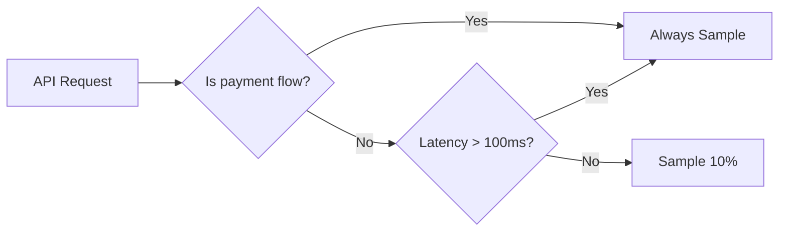

```markdown
---
title: "Mastering Tracing Tuning: Optimizing Distributed Tracing for Performance and Insights"
date: 2023-11-15
author: Jane Doe
tags: ["distributed_tracing", "performance_optimization", "observability", "backend_patterns", "observability_engineering"]
---

# Mastering Tracing Tuning: Optimizing Distributed Tracing for Performance and Insights

## Introduction

As distributed systems grow in complexity, so do the challenges of understanding their behavior. Distributed tracing—a cornerstone of modern observability—helps us visualize request flows, pinpoint bottlenecks, and debug latency issues across microservices. But here’s the catch: **raw tracing data can quickly become a performance liability**. Without proper tuning, tracing can introduce latency, consume enormous storage costs, and even mask the very issues you’re trying to solve.

In this guide, we’ll demystify tracing tuning—how to strike the balance between granularity and performance, ensuring your traces provide actionable insights without sabotaging system health. We’ll cover practical strategies, real-world code examples, and tradeoffs to help you instrument your systems effectively. By the end, you’ll have the tools to optimize tracing for both observability needs and operational constraints.

---

## The Problem: When Tracing Becomes a Bottleneck

Imagine this scenario: Your team recently deployed OpenTelemetry in a 100+ microservice architecture to gain visibility into request flows. Initially, it worked wonderfully—you could trace requests from the frontend through payment processing, inventory checks, and analytics—all in one view. But weeks later, you notice something alarming:

- **Latency spikes**: Response times for API endpoints jump by 300ms during peak hours, and the team can’t pinpoint the source.
- **Storage explosion**: Your tracing backend (Jaeger, Zipkin, or a commercial observability platform) consumes 50% of your monthly storage budget.
- **Sampling hell**: You configure 100% sampling for critical paths (e.g., payment processing) only to realize that the system is now **too slow** to handle traffic, making the whole tracing effort counterproductive.

This is the classic "tracing curse": adding observability backfires because the solution itself creates the problems it’s supposed to solve. The root causes typically fall into these categories:

1. **Overhead from raw span sampling**: Every HTTP request, database query, and service call is logged as a span, creating a firehose of data.
2. **Inconsistent sampling strategies**: Some critical flows are oversampled, while others are undersampled, leaving blind spots.
3. **Unbounded context propagation**: Traces become too wide (e.g., including all possible downstream calls), making them hard to analyze.
4. **Ignoring tail latency**: High-cardinality requests (e.g., rare but long-running transactions) don’t get enough attention because they’re drowned out by common, fast flows.

### Real-World Impact
A 2022 Gartner report found that **poorly tuned traces account for up to 20% of the total cost of observability stacks** in large enterprises. Meanwhile, teams attempting to "fix" tracing by increasing sampling rates often end up exacerbating the issue, leading to cascading failures or degraded user experience.

---

## The Solution: Tracing Tuning Principles

Tracing tuning is not about disabling observability—it’s about **intentional design**. The goal is to collect enough data to answer critical questions (e.g., "Why is this request taking 5 seconds?") while minimizing the impact on system performance and cost. Here’s how we approach it:

1. **Sampling Strategies**: Explicitly decide what to trace and when, based on business needs.
2. **Span Filtering**: Limit the scope of spans to only what’s relevant to the diagnostic context.
3. **Head vs. Tail Latency**: Optimize for both common and rare but critical paths.
4. **Context Propagation**: Control the width of traces to avoid "data pollution."
5. **Instrumentation Hygiene**: Write efficient SDK integrations that avoid leaking tracing overhead.
6. **Cost Awareness**: Align sampling with storage and compute budgets.

---

## Components & Solutions

### 1. Sampling Strategies
Sampling determines which requests get traced. Poor sampling leads to either too much noise (inefficient storage) or too few insights (missed issues). Here are the most common approaches:

#### a) Probabilistic Sampling
Every request has a fixed probability (e.g., 10%) of being sampled. Simple but ineffective for skewed distributions.

```java
// Example: OpenTelemetry Java SDK with probabilistic sampling
Sampler sampler = Samplers.alwaysOn(); // Always sample (for testing)
Sampler probabilisticSampler = Samplers.parentBased(Samplers.alwaysOn()); // Overrides child samplers

// Configure in your trace provider
TraceProvider.builder()
    .setSampler(probabilisticSampler)
    .build();
```

#### b) Head-Based Sampling
Sample requests based on their **initial behavior** (e.g., high latency in the first step). Great for detecting early bottlenecks.

```go
// Example: Head-based sampling in Go with OpenTelemetry
samplingDecision := headBasedSamplingDecision(
    context.Background(),
    "routerHandler",
    0.1, // 10% sampling rate
    500, // ms threshold for considering a request "slow"
)
if samplingDecision.IsRecorded() {
    // Start a trace for this request
}
```

#### c) Tail-Based Sampling
Sample requests based on **long-running or expensive downstream calls**. Ideal for skewed workflows (e.g., 1% of transactions take 99% of time).

```python
# Example: Tail-based sampling in Python with OpenTelemetry
from opentelemetry import trace
from opentelemetry.sdk.trace import TracerProvider
from opentelemetry.sdk.trace.export import BatchSpanProcessor
from opentelemetry.sdk.trace.sampling import ParentBasedSampler, SamplingDecision, SamplingResult

class TailBasedSampler(SamplingResult):
    def __init__(self, threshold_ms: int = 1000):
        self.threshold_ms = threshold_ms

    def should_sample(self, parent_context: Any, trace_id: str, name: str) -> SamplingDecision:
        # Simulate checking downstream latency (in a real app, use metrics)
        downstream_latency = 1500  # hypothetical 1.5s call
        return SamplingDecision(
            recorded=True,
            decision=SamplingResult.SamplingResult.record_and_sample
        ) if downstream_latency > self.threshold_ms else SamplingDecision(
            recorded=False,
            decision=SamplingResult.SamplingResult.drop
        )

# Apply to tracer provider
tracer_provider = TracerProvider()
tracer_provider.add_span_processor(
    BatchSpanProcessor(
        exporter=SomeExporter(),
        sampler=TailBasedSampler()
    )
)
```

#### d) Hybrid Strategies
Combine probabilistic and head/tail sampling for context-aware tuning. Example: Sample 50% of all requests, but **always** sample payment flows.

```typescript
// Example: Hybrid sampling in Node.js
const { Sampler, alwaysOn, probabilistic } = require("@opentelemetry/sdk-trace-base");

const hybridSampler = new class extends Sampler {
    constructor() {
        super();
        this.probabilistic = probabilistic(0.5); // Sample 50% of traffic
        this.paymentFlow = alwaysOn(); // Always sample payments
    }

    shouldCollect(context: Context, traceId: string, name: string): Decision {
        const isPaymentFlow = name.includes("payment");
        return isPaymentFlow
            ? this.paymentFlow.shouldCollect(context, traceId, name)
            : this.probabilistic.shouldCollect(context, traceId, name);
    }
}();

const provider = new TracerProvider();
provider.addSpanProcessor(new SimpleSpanProcessor(new CustomExporter()));
provider.setSampler(hybridSampler);
```

---

### 2. Span Filtering
Not all spans are equally useful. Filtering reduces noise and cost by selectively including spans relevant to debugging.

#### a) Resource Filtering
Ignore spans from low-value components (e.g., internal health checks).

```java
// Filter out spans from low-value services
Filter resourceFilter = Filter.builder()
    .addAttribute("service.name", "!health-check")
    .build();

SpanProcessor filteredSpanProcessor = new FilteringSpanProcessor(
    new AsyncSpanProcessor(new JaegerExporter()),
    resourceFilter
);
```

#### b) Attribute Filtering
Exclude spans lacking critical metadata (e.g., missing `user_id` or `transaction_id`).

```python
# Example: Attribute-based filtering in Python
from opentelemetry.sdk.trace import SpanProcessor
from opentelemetry.sdk.trace.export import BatchSpanProcessor
from opentelemetry.sdk.resources import Resource

class CriticalAttributeFilter(SpanProcessor):
    def on_start(self, span):
        # Ignore spans missing critical metadata
        if not span.attributes.get("user_id") or not span.attributes.get("transaction_id"):
            span.set_recorded(False)
```

---

### 3. Context Propagation
Traces often "bleed" into too many downstream services, inflating size and cost. Control propagation with these techniques:

#### a) Circuit Breaker for Context
Limit trace width by disabling propagation after a certain depth.

```go
// Example: Go middleware to limit trace width
func Middleware(next http.Handler) http.Handler {
    return http.HandlerFunc(func(w http.ResponseWriter, r *http.Request) {
        ctx := r.Context()
        if trace.SpanFromContext(ctx).SpanKind() == trace.SpanKindServer {
            // Limit trace width to 3 hops
            if trace.SpanFromContext(ctx).Attributes().Len() > 3 {
                newCtx := context.WithValue(ctx, "skipPropagation", true)
                r = r.WithContext(newCtx)
            }
        }
        next.ServeHTTP(w, r)
    })
}
```

#### b) Selective Attribute Propagation
Only forward critical attributes (e.g., `user_id` or `transaction_id`) to avoid bloating traces.

```typescript
// Example: Selective propagation in Node.js
const { Context } = require("@opentelemetry/api");

function selectContext(ctx: Context): Context {
    const rawCtx = ctx as any;
    const currentSpan = rawCtx.__otel_currentSpan;
    if (!currentSpan) return ctx;

    const propagated = {
        user_id: currentSpan.attributes.user_id,
        transaction_id: currentSpan.attributes.transaction_id,
    };

    // Create a new context with only critical attributes
    return Context.withValue(ctx, "__otel_currentSpan", {
        ...currentSpan,
        attributes: propagated,
    });
}
```

---

### 4. Instrumentation Hygiene
How you instrument code can add or remove overhead. Optimize with these tips:

#### a) Async Callouts
Avoid blocking spans during database calls or external API calls. Use async spans where possible.

```python
# Bad: Blocking span
def slow_db_query():
    with tracer.start_span("db.query") as span:
        result = db.execute("SELECT * FROM users")  # Blocks while waiting for DB
        return result

# Good: Async span
async def async_db_query():
    async with tracer.start_as_async_span("db.query") as span:
        result = await db.execute_async("SELECT * FROM users")  # Non-blocking
        return result
```

#### b) Explicit Context Passing
Pass tracing context explicitly via middleware or dependencies to avoid leakage.

```java
// Example: Explicit context in a Spring Boot controller
@RestController
public class UserController {
    private final Tracer tracer;

    public UserController(Tracer tracer) {
        this.tracer = tracer;
    }

    @GetMapping("/user/{id}")
    public User getUser(@PathVariable Long id) {
        Context context = Context.current();
        try (Context.Store store = Context.current().fork()) {
            Context newContext = Context.current().withValue("user_id", id);
            try {
                return userService.getUser(id, newContext);
            } finally {
                store.close(); // Release context
            }
        }
    }
}
```

---

## Implementation Guide

### Step 1: Audit Your Sampling
1. **Check current sampling rates**: Are you over-sampling? Are critical paths under-sampled?
   ```bash
   # Example: Query Jaeger for sampling stats
   curl -XPOST "http://jaeger-query:16686/api/TraceService/searchTraces"
   ```
2. **Analyze latency distributions**: Use percentiles to identify head vs. tail issues.
   ```sql
   -- Find 99th percentile latency for payment flows
   SELECT PERCENTILE_CONT(0.99) WITHIN GROUP (ORDER BY latency_ms)
   FROM traces
   WHERE service_name = 'payment-service';
   ```

### Step 2: Define Sampling Policies
Align sampling with business impact:
- **Always-sample paths**: Payment processing, authentication, and order flows.
- **Probabilistic paths**: Marketing analytics, recommendation systems.
- **Head-based paths**: High-throughput APIs with known early latencies.
- **Tail-based paths**: Rare but critical transactions (e.g., high-value orders).

### Step 3: Implement Sampling Strategies
Use the code examples above and adapt them to your stack (Java, Go, Python, etc.). Example pipeline:



### Step 4: Filter Spans
Apply filters to reduce noise:
- Skip spans from health checks (`service.name != "health-check"`).
- Ignore spans missing critical attributes (e.g., `user_id`).

```python
# Apply filters in Python
from opentelemetry.sdk.trace import TracerProvider
from opentelemetry.sdk.trace.export import FilteringSpanProcessor, SimpleSpanProcessor

filter = Filter(
    lambda span: span.attributes.get("user_id") is not None
    and span.attributes.get("transaction_id") is not None
)

processor = FilteringSpanProcessor(
    SimpleSpanProcessor(
        SomeExporter()
    ),
    filter
)
provider.add_span_processor(processor)
```

### Step 5: Monitor Sampling Impact
Set up alerts for:
- **Sampling rate drift**: Sudden changes may indicate misconfigurations.
- **Storage growth**: Alert when traces exceed 80% of the storage quota.
- **Latency regression**: Monitor for 100ms+ increases in traced vs. untraced requests.

```sql
-- Alert if storage cost exceeds budget
SELECT
    SUM(size_bytes) AS total_traces_bytes,
    1.2 * (SELECT quota_bytes FROM quotas WHERE service = 'tracing')
FROM traces
WHERE created_at >= DATEADD(day, -7, CURRENT_DATE);
```

### Step 6: Iterate on Feedback
Ask key questions:
- Are we missing critical debug cases?
- Is the trace data actionable? (e.g., can we answerlatency issues with <30s?)
- Is the storage cost justified by the insights?

---

## Common Mistakes to Avoid

1. **One-Size-Fits-All Sampling**
   - Avoid uniform sampling (e.g., 10% for everything). Critical paths may need 100%.

2. **Ignoring Tail Events**
   - Sampling only the head (e.g., first 10ms) misses long-running workflows. Use tail-based sampling.

3. **Over-Proliferating Spans**
   - Every logging call or database query doesn’t need a span. Focus on meaningful boundaries (e.g., HTTP calls, DB transactions).

4. **Not Aligning with SLOs**
   - Sample based on your service-level objectives (e.g., 99.9% of transactions should be traced for payment flows).

5. **Forgetting to Test**
   - Validate tuning changes under load. Use tools like k6 to simulate traffic and measure overhead.

---

## Key Takeaways

- **Sampling is intentional**: Don’t treat it as a toggle—design policies based on business needs.
- **Optimize for head AND tail**: Don’t neglect rare but critical paths (e.g., fraud detection).
- **Filter aggressively**: Remove noise from irrelevant spans and attributes.
- **Control context width**: Limit trace propagation to avoid "data pollution."
- **Monitor sampling impact**: Use metrics and alerts to detect misconfigurations early.
- **Iterate**: Tracing tuning is ongoing—review and refine policies as your system evolves.

---

## Conclusion

Tracing tuning is one of the most underrated yet powerful tools in observability engineering. Done right, it transforms tracing from a costly overhead into a **precision instrument** for debugging and optimization. Done wrong, it becomes a performance tax that erodes your system’s agility.

The key is balance: **collect enough data to answer critical questions, but minimize the cost and impact**. By leveraging sampling strategies, span filtering, and context control, you can build a tracing system that scales with your needs—and your budget.

### Next Steps
1. **Start small**: Audit your current sampling and apply head-based or hybrid strategies to critical paths.
2. **Experiment**: Use tail-based sampling for high-value transactions and measure the impact on storage and latency.
3. **Measure**: Track how traced vs. untraced requests behave. Aim for <10% overhead on core workflows.
4. **Iterate**: Review traces weekly and adjust policies based on what you’re learning.

Remember: **Great tracing is like a good detective story—it reveals the clues you need, without drowning you in red herrings.**

---
```