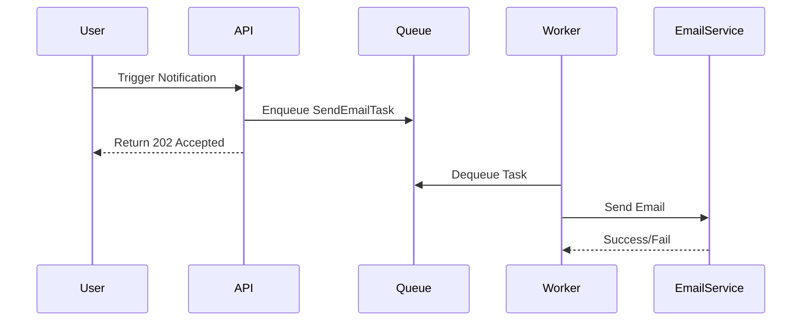

```markdown
# **Notification Systems Patterns: Building Scalable and Reliable Alerting Systems**

*How to design flexible notification systems that work in production—and avoid common pitfalls*

---

## **Introduction**

Notifications are the lifeblood of many applications: from email digests and in-app alerts to SMS confirmations and system alerts. A well-designed notification system ensures users stay informed, while a poorly built one leads to missed messages, user frustration, and technical debt.

As a backend engineer, you’ve likely grappled with decisions like:
- *"Should we use async processing or block requests while sending notifications?"*
- *"How do we handle retries for failed emails or push alerts?"*
- *"Can we scale this without hitting database bottlenecks?"*

In this guide, we’ll explore **notification system patterns**—best practices, tradeoffs, and practical code examples—to help you build reliable, scalable notifications.

---

## **The Problem**

Notifications introduce complexity because they involve multiple moving parts:

1. **Latency and Blocking**: Sync notifications (e.g., waiting for an email to send before returning a response) slow down APIs, hurting user experience.
2. **Reliability**: Failed deliveries (e.g., incorrect email addresses, network issues) must be retried gracefully without losing data.
3. **Scalability**: High-volume systems (e.g., a SaaS platform with 10,000 users) need async processing to avoid overwhelmed backend servers.
4. **User Customization**: Users often prefer different notification channels (email, SMS, in-app) at different times.
5. **Eventual Consistency**: Notifications may fail temporarily but should retry until successful (e.g., a delayed email due to a server restart).

---

## **The Solution: Core Patterns**

A robust notification system combines several patterns:

| Pattern               | Purpose                                                                 |
|-----------------------|-------------------------------------------------------------------------|
| **Async Processing**  | Offloads notifications to background workers to avoid blocking calls.   |
| **Event-Driven Architecture** | Uses events (e.g., RabbitMQ, Kafka) to decouple notification logic.     |
| **Retry & Queueing**  | Handles transient failures via exponential backoff and dead-letter queues. |
| **Template-Based Rendering** | Dynamically generates notifications (e.g., emails, SMS) using templates. |
| **Subscriber Management** | Lets users choose notification preferences (e.g., disable emails).   |

---

## **Implementation Guide**

Let’s build a **scalable notification system** using these patterns.

### **1. Async Processing with a Queue**

Instead of sending notifications synchronously, we use a job queue (e.g., **Celery + Redis, Bull, or SQS**).

#### **Example: Sending an Email via a Queue**
```python
# Using Python with Celery (async task queue)
from celery import Celery

app = Celery('tasks', broker='redis://localhost:6379/0')

@app.task(bind=True)
def send_email_task(self, recipient, template_name, context):
    # Simulate sending an email (retries if failed)
    try:
        send_email(recipient, template_name, context)
    except Exception as e:
        self.retry(exc=e, countdown=60)  # Retry in 60 seconds
```



**Tradeoffs**:
✅ Non-blocking API responses.
❌ Adds infrastructure complexity (queue + workers).

---

### **2. Event-Driven Architecture**

Decouple notification logic from business logic using events (e.g., **Kafka, RabbitMQ**).

#### **Example: Notification Event Bus**
```python
# Using RabbitMQ (Python with Pika)
import pika

connection = pika.BlockingConnection(pika.ConnectionParameters('localhost'))
channel = connection.channel()
channel.queue_declare(queue='notifications')

def publish_notification(event_type, user_id, payload):
    message = {
        'event': event_type,
        'user_id': user_id,
        'payload': payload
    }
    channel.basic_publish(
        exchange='',
        routing_key='notifications',
        body=json.dumps(message)
    )

# Business logic -> Event Bus
publish_notification('user_created', 123, {'name': 'Alice'})
```

**Workers Consume Events**:
```python
def handle_notifications():
    def callback(ch, method, properties, body):
        event = json.loads(body)
        if event['event'] == 'user_created':
            send_welcome_email(event['user_id'])

    channel.basic_consume('notifications', callback, auto_ack=True)
    channel.start_consuming()
```

**Tradeoffs**:
✅ Decouples senders/receivers.
❌ Requires event infrastructure (broker, consumers).

---

### **3. Retry & Dead-Letter Queues**

Failed notifications should retry with backoff. Use **dead-letter queues (DLQ)** for permanent failures.

#### **Example: Retry Logic with Redis Queue**
```python
# Using Bull (Node.js)
const Queue = require('bull');
const queue = new Queue('notifications', 'redis://localhost:6379');

queue.process(async (job) => {
    const { recipient, type, data } = job.data;
    try {
        await send_notification(recipient, type, data);
    } catch (err) {
        throw err; // Retry with exponential backoff
    }
});

// Add to DLQ if retries exceed max
queue.on('failed', (job, err) => {
    console.error(`Failed after retries:`, err);
    queue.add('dlq', { jobId: job.id, error: err.message });
});
```

**Tradeoffs**:
✅ Handles transient failures gracefully.
❌ Requires monitoring for stuck jobs in DLQ.

---

### **4. Template-Based Rendering**

Use **templates** (e.g., Jinja2, Handlebars) to dynamically generate notifications.

#### **Example: Email Template (Python)**
```python
# templates/welcome_email.html
Hello {{ user.name }},<br>
Welcome to our platform!<br>
Your account is ready.<br>
```

```python
# Render template
from jinja2 import Template

email_template = Template(open('templates/welcome_email.html').read())
rendered_email = email_template.render(user={'name': 'Alice'})
```

**Tradeoffs**:
✅ Easy to customize.
❌ Adds complexity if templates are misused (e.g., XSS).

---

### **5. Subscriber Management**

Let users choose how to receive notifications.

#### **Example: User Preferences (SQL)**
```sql
CREATE TABLE user_preferences (
    user_id INT PRIMARY KEY,
    email_notifications BOOLEAN DEFAULT TRUE,
    sms_notifications BOOLEAN DEFAULT FALSE,
    push_notifications BOOLEAN DEFAULT TRUE
);
```

```python
# Check preferences before sending
def should_send_email(user_id):
    with connection.cursor() as cursor:
        cursor.execute("SELECT email_notifications FROM user_preferences WHERE user_id = %s", (user_id,))
        return cursor.fetchone()[0]
```

---

## **Common Mistakes to Avoid**

1. **Blocking APIs for Notifications**
   *❌* `send_email()` on the main request thread.
   *✅* Use async queues (Celery, SQS).

2. **Ignoring Retry Logic**
   *❌* No retries for failed emails.
   *✅* Implement exponential backoff + DLQ.

3. **Poor Event Naming**
   *❌* `event: 'notify_user'` (vague).
   *✅* `event: 'user_created_notify_email'`.

4. **Hardcoding Notification Channels**
   *❌* Always send emails.
   *✅* Fetch user preferences dynamically.

5. **No Monitoring**
   *❌* No alerts for failed notifications.
   *✅* Use tools like Prometheus + Grafana.

---

## **Key Takeaways**

- **Async is key**: Use queues (Celery, Bull, SQS) to avoid blocking APIs.
- **Decouple with events**: RabbitMQ/Kafka helps scale and maintain notifications.
- **Retry failures**: Exponential backoff + DLQ ensures reliability.
- **Templates > Hardcoding**: Dynamic content improves user experience.
- **Respect user choices**: Fetch preferences before sending.

---

## **Conclusion**

Building a notification system is about balancing **scalability, reliability, and maintainability**. By leveraging async processing, event-driven architecture, and intelligent retries, you can avoid common pitfalls like slow APIs or lost messages.

**Start small**: Begin with a simple queue (e.g., Celery) and expand to events (Kafka) as needs grow. Monitor failures, and respect user preferences.

Now go build something great—and make sure your notifications **never get ignored**!
```

---
**P.S.** Want to dive deeper?
- [Celery Docs](https://docs.celeryq.dev/)
- [Event-Driven Architecture Patterns](https://www.eventstore.com/blog/basics-of-event-driven-architecture/)
- [Designing Reliable Systems (Google)](https://www.youtube.com/watch?v=HqwT0fXA7B8)