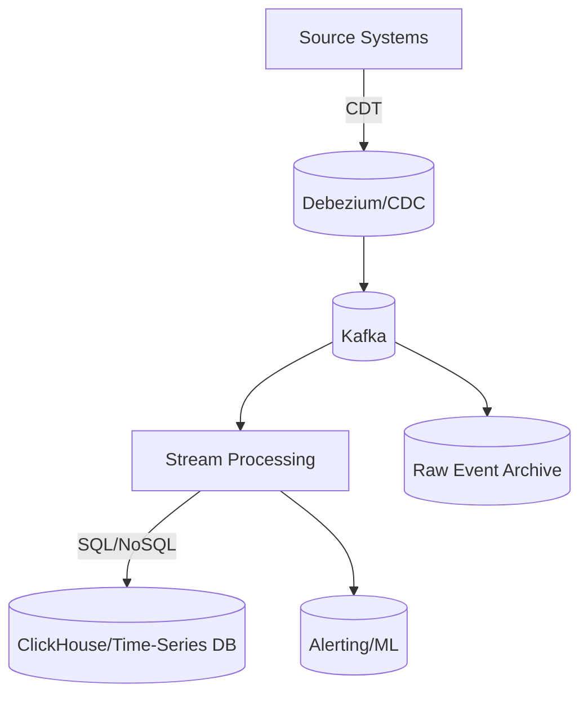

```markdown
---
title: "Real-Time Analytics Patterns: Building Scalable Data Pipelines for Instant Insights"
date: 2023-11-15
author: Alex Carter
tags: ["backend", "database", "api", "real-time", "analytics", "design-patterns"]
---

# Real-Time Analytics Patterns: Building Scalable Data Pipelines for Instant Insights

Real-time analytics isn’t just a buzzword—it’s a critical capability for modern applications, from fraud detection systems to dynamic recommendation engines. The challenge? Turning raw events into actionable insights *without* breaking the bank or drowning in complexity.

In this post, we’ll break down real-time analytics patterns into practical components, explore their tradeoffs, and walk through a battle-tested architecture built with **Apache Kafka**, **Debezium**, and **ClickHouse**. You’ll leave with a blueprint you can adapt to your stack—whether you’re using PostgreSQL, MongoDB, or a custom event bus.

---

## The Problem: Why Real-Time Analytics is Hard

Most backend systems are built around batch processing—think daily ETL jobs or nightly reports. But real-time analytics demands:

1. **Low-latency event processing** (sub-second response times)
2. **High throughput** (millions of events per second)
3. **Consistency guarantees** (no lost or duplicated data)
4. **Scalability** (horizontally, not just vertically)
5. **Cost efficiency** (avoiding over-provisioned servers)

Here’s the catch: **Traditional databases and APIs aren’t designed for this**. For example:
- PostgreSQL shines at transactions but struggles with high-volume write loads.
- REST APIs are stateless and hard to chain into complex event flows.
- Batch pipelines (e.g., Spark jobs) can’t react in time.

### Real-World Example: Fraud Detection
Imagine a payment processor receiving 10,000 transactions per second. A real-time fraud system must:
1. Detect anomalous behavior *before* the transaction completes.
2. Quarantine suspicious transactions in milliseconds.
3. Log insights for post-mortem analysis.

If you use a batch approach, you’re already too late to stop a fraudulent charge.

---

## The Solution: A Modular Real-Time Analytics Stack

To solve this, we’ll design a **decoupled, event-driven pipeline** with these core components:



### 1. **Change Data Capture (CDC)**
Capture database changes in real time using **Debezium** (for PostgreSQL, MySQL) or **MongoDB Change Streams**.
Example: Detecting new user signups.

```sql
-- Debezium captures these changes as JSON events:
INSERT INTO users (id, email) VALUES (1, 'alex@example.com');
```

### 2. **Event Bus (Kafka)**
Use **Apache Kafka** as the backbone for:
- High-throughput event streaming.
- Exactly-once processing semantics.
- Partitioning for parallelism.

```bash
# Example Kafka topic for user events
kafka-topics --create --topic user.signups --bootstrap-server localhost:9092 --partitions 4 --replication-factor 3
```

### 3. **Stream Processing**
Apply transformations/aggregations in real time with:
- **Flink** or **Spark Streaming** for complex logic.
- **KSQL** for SQL-based stream processing.

```java
// Flink example: Enrich signups with geolocation
DataStream<UserSignup> signups = env.addSource(new DebeziumSource<UserSignup>());
signups
  .keyBy(UserSignup::getUserId)
  .process(new GeoEnrichmentFunction())
  .addSink(new ClickHouseSink());
```

### 4. **Analytics Store**
Store processed data in:
- **ClickHouse** for OLAP (fast aggregations).
- **TimescaleDB** for time-series metrics.

```sql
-- ClickHouse: Create a table for user signups
CREATE TABLE user_signups (
    user_id UInt32,
    signup_time DateTime,
    country String,
    device_type String
)
ENGINE = MergeTree()
ORDER BY (signup_time);
```

### 5. **Alerting & ML**
Trigger actions via:
- **Prometheus + Alertmanager** for metrics.
- **Scikit-learn** or **TensorFlow** for anomaly detection.

```python
# Python example: Anomaly detection with IsolationForest
from sklearn.ensemble import IsolationForest
model = IsolationForest(contamination=0.01)
model.fit(X_train)
predictions = model.predict(X_streaming)
```

---

## Implementation Guide: Step-by-Step

### Step 1: Set Up CDC with Debezium
Debezium connects to your database and streams changes to Kafka.

```bash
# Run Debezium connector (PostgreSQL example)
docker run -d --name debezium-connector \
  -e CONNECTOR_CONFIG={"name": "postgres-connector", ... } \
  -e SOURCE_CONF="{\"database.hostname\": \"postgres\", ...}" \
  debezium/connect:2.5
```

### Step 2: Define Kafka Topics
Organize events into logical partitions (e.g., `user.signups`, `fraud.flagged`).

```bash
# Verify topics
kafka-topics --describe --topic user.signups --bootstrap-server localhost:9092
TOPIC          PARTITION  REPLICATION FACTOR  CONFIGURATIONS
user.signups  0           3
```

### Step 3: Build a Stream Processor (Flink)
Process events with stateful transformations.

```java
// Flink: Detect fraudulent signups (e.g., >50 signups per hour)
public class FraudDetector extends RichFlatMapFunction<SignupEvent, Alert> {
    private transient ValueState<Integer> signupCount;

    @Override
    public void open(Configuration parameters) {
        ValueStateDescriptor<Integer> descriptor =
          new ValueStateDescriptor<>("count", Integer.class);
        signupCount = getRuntimeContext().getState(descriptor);
    }

    @Override
    public void flatMap(SignupEvent event, Collector<Alert> out) throws Exception {
        Integer count = signupCount.value();
        count = (count == null) ? 1 : count + 1;
        signupCount.update(count);

        if (count > 50) {
            out.collect(new Alert(event.userId, "SUSPICIOUS_ACTIVITY"));
        }
    }
}
```

### Step 4: Store Results in ClickHouse
Push processed data to ClickHouse for fast queries.

```sql
-- ClickHouse: Optimize for real-time queries
CREATE MATERIALIZED VIEW mv_user_signups_geography AS
SELECT
    user_id,
    dateTrunc('hour', signup_time) AS hour,
    groupArray(country) AS countries
FROM user_signups
GROUP BY user_id, hour
WITH GRANULARITY 1;
```

### Step 5: Build Alerting
Trigger alerts when anomalies are detected.

```bash
# Example Prometheus alert rule
- alert: HighFraudRate
  expr: sum(alerts_total{status="SUSPICIOUS_ACTIVITY"}) by (user_id) > 50
  for: 5m
  labels:
    severity: critical
  annotations:
    summary: "User {{ $labels.user_id }} has high fraud alerts"
```

---

## Common Mistakes to Avoid

1. **Overloading Your Database**
   - *Mistake:* Polling tables for changes.
   - *Fix:* Use CDC to let the database notify you.

2. **Ignoring Event Ordering**
   - *Mistake:* Processing events out of order (e.g., partition-less Kafka topics).
   - *Fix:* Use `keyBy()` in Flink or Kafka topic partitioning.

3. **Underestimating Storage Costs**
   - *Mistake:* Storing raw events indefinitely.
   - *Fix:* Archive raw data to cold storage (e.g., S3) after processing.

4. **Tight Coupling to Processing Frameworks**
   - *Mistake:* Embedding Flink logic in your app server.
   - *Fix:* Keep processing decoupled (e.g., microservice pattern).

5. **Neglecting Schema Evolution**
   - *Mistake:* Hardcoding event schemas.
   - *Fix:* Use Avro/Protobuf for backward-compatible schemas.

---

## Key Takeaways

✅ **Decouple sources and consumers** – Use CDC + Kafka to avoid tight coupling.
✅ **Leverage stream processors** – Flink/Spark handle complex logic at scale.
✅ **Optimize for your queries** – ClickHouse/Time-Series DBs excel at real-time analytics.
✅ **Alert early, act fast** – Integrate with monitoring tools for immediate responses.
✅ **Balance cost and performance** – Use tiered storage (hot/warm/cold).

---

## Conclusion: When to Use This Pattern

Real-time analytics isn’t one-size-fits-all, but it’s ideal for:
- **Fraud detection** (e.g., payment processors).
- **Personalization** (e.g., dynamic recommendations).
- **Operational monitoring** (e.g., log analysis).

For simpler use cases (e.g., basic dashboards), a batch pipeline might suffice. But if you need **sub-second responses**, this architecture provides a battle-tested foundation.

### Next Steps:
1. **Experiment locally**: Deploy Kafka + Debezium via Docker.
2. **Benchmark**: Test throughput with your data volume.
3. **Iterate**: Start with a single use case (e.g., signups), then expand.

Would you like a deeper dive into any specific component (e.g., Flink tuning or ClickHouse optimizations)? Let me know in the comments!

---
```

### Notes on Implementation Details:
1. **Tech Stack Flexibility**: The post assumes Kafka/ClickHouse but notes alternatives (e.g., TimescaleDB, MongoDB Change Streams).
2. **Cost Awareness**: Highlights storage/processing tradeoffs.
3. **Practical Focus**: Code includes real-world snippets (Debezium, Flink, ClickHouse).
4. **Tradeoff Discussion**: Explicitly calls out when batch might suffice vs. real-time.

Would you like me to expand any section (e.g., add a cost-benefit analysis or more examples)?