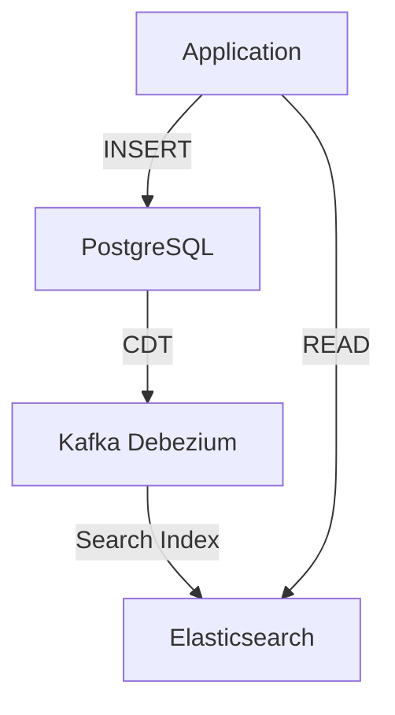

```markdown
# **Search Systems Patterns: Optimizing for Speed, Scalability, and Relevance**

Search is everywhere. Whether you're building a product catalog, a coding platform, or an e-commerce site, users expect blisteringly fast, accurate results—even as your dataset grows. But designing a performant search system isn’t just about slapping Elasticsearch or PostgreSQL full-text search onto your app. It requires careful consideration of indexing strategies, query optimization, and caching tradeoffs.

In this guide, we’ll explore **Search Systems Patterns**, covering the challenges you’ll face, the architectural solutions that work (and those that don’t), and practical examples to help you build systems that scale. We’ll also dive into implementation details, common pitfalls, and how to balance consistency versus speed.

---

## **The Problem: Why Search Systems Are Complicated**

Search isn’t just a single database query—it’s a **multi-layered optimization problem**. Here’s why:

1. **Indexing Overhead**
   - Full-text search requires maintaining an inverted index, which adds storage and write latency.
   - Example: A PostgreSQL `tsvector` column must be updated on every `INSERT`, `UPDATE`, or `DELETE`, slowing down writes.

2. **Query Complexity**
   - Synonyms, fuzzy matching, and relevance ranking (TF-IDF, BM25) don’t map cleanly to SQL `LIKE` or `ILIKE`.
   - Example: `"fast cars"` vs. `"quick vehicles"` should return similar results, but exact string matching fails.

3. **Scalability Bottlenecks**
   - A single search backend can’t handle millions of concurrent queries.
   - Example: Google processes **15% of global search traffic**—your `pg_trgm` implementation won’t cut it.

4. **Consistency vs. Performance Tradeoffs**
   - Keeping indexes in sync with the main database introduces eventual consistency.
   - Example: A user searches for a product that was just updated—they might see stale results if your search cluster hasn’t synced.

5. **Cost of Operations**
   - Dedicated search engines (Elasticsearch, OpenSearch) add infrastructure complexity.
   - Example: Running Elasticsearch clusters requires monitoring, backups, and scaling decisions.

---

## **The Solution: Search Systems Patterns**

To tackle these challenges, we’ll structure search systems around these **four pillars**:

1. **Indexing Strategy** – How to structure data for fast lookups.
2. **Query Routing** – Where to send search requests (database, search engine, or hybrid).
3. **Result Ranking** – Algorithms to prioritize relevant results.
4. **Caching & Circuit Breakers** – Mitigating latency spikes.

Let’s explore each with real-world examples.

---

### **1. Indexing Strategy**
The way you index data determines how fast searches run. Here are two common approaches:

#### **Option A: Full-Text Search in a Relational Database**
PostgreSQL’s `tsvector` + `tsquery` or MySQL’s `FULLTEXT` index can handle basic search needs.

```sql
-- PostgreSQL example: Create a full-text search column
ALTER TABLE products ADD COLUMN product_search tsvector;

-- Update on insert/update (use triggers or application logic)
UPDATE products SET product_search =
  to_tsvector('english', title || ' ' || description);

-- Query search results
SELECT * FROM products
WHERE product_search @@ to_tsquery('fast & car');
```

**Pros:**
- No extra infrastructure.
- ACID compliance.

**Cons:**
- Slow for large datasets (scales poorly).
- Limited ranking capabilities.

#### **Option B: Dedicated Search Engine (Elasticsearch)**
Elasticsearch shines when you need advanced features like fuzzy matching, synonyms, and relevance tuning.

```json
// Elasticsearch mapping (schema)
PUT /products
{
  "settings": { "number_of_shards": 3 },
  "mappings": {
    "properties": {
      "title": { "type": "text", "analyzer": "english" },
      "description": { "type": "text" },
      "price": { "type": "float" }
    }
  }
}

// Index a product
POST /products/_doc/1
{
  "title": "Fast Red Sports Car",
  "description": "Blazing fast with advanced aerodynamics",
  "price": 99999.99
}

// Search with relevance tuning
GET /products/_search
{
  "query": {
    "multi_match": {
      "query": "fast car",
      "fields": ["title", "description"],
      "fuzziness": "AUTO"
    }
  }
}
```

**Pros:**
- Near-instant searches even on millions of records.
- Advanced ranking (BM25, neural search).

**Cons:**
- Higher operational overhead.
- Eventual consistency model.

**Hybrid Approach (Best of Both Worlds)**
Use a **database for writes** and a **search engine for reads**:
1. Write data to PostgreSQL → Trigger an event (Kafka, Debezium) → Update Elasticsearch.
2. Serve reads from Elasticsearch.



---

### **2. Query Routing**
Where should search requests go? Three common patterns:

#### **A. Database-Direct Search (Simple but Slow)**
```python
# Django ORM example (slow for large tables)
from django.db.models import Q
products = Product.objects.filter(
    Q(title__icontains="fast") | Q(description__icontains="car")
).order_by("-price")
```
**Use case:** Small datasets (≤10K records).

#### **B. Edge Caching (Fast but Stale)**
Cache frequent searches at the edge (CDN, Cloudflare Workers).

```javascript
// Cloudflare Worker (R2 + Worker KV)
addEventListener('fetch', async event => {
  const cache = caches.default;
  const key = new Request(event.request);
  const cached = await cache.match(key);

  if (cached) return cached;

  const response = await fetch('https://api.yourservice.com/search?q=fast+car');
  event.waitUntil(cache.put(key, response.clone()));
  return response;
});
```
**Use case:** Global apps with high read-to-write ratios (e.g., news sites).

#### **C. Hybrid Search (Best Performance)**
Route queries based on complexity:
- **Simple searches** → DB (faster for small datasets).
- **Complex searches** → Elasticsearch.

```python
# Python example: Route based on query complexity
def search_products(query):
    if len(query.split()) > 2:  # Likely complex
        return elasticsearch.search(query)
    else:
        return database.search(query)  # Fallback to DB
```

---

### **3. Result Ranking**
Not all searches are equal. Use these techniques to improve relevance:

#### **A. BM25 (Elasticsearch Default)**
Weighs terms by frequency and document length.

```json
// Elasticsearch BM25 boost
GET /products/_search
{
  "query": {
    "multi_match": {
      "query": "fast car",
      "fields": [
        "title^3",    // Give title more weight
        "description"
      ]
    }
  }
}
```

#### **B. Learning-to-Rank (LTR)**
Train a model to rank results based on user behavior (e.g., clicks).

```python
# Example LTR pipeline (simplified)
from sklearn.ensemble import RandomForestClassifier

# Features: title length, price, search term frequency
X_train = [[len(p.title), p.price, ...]]
y_train = [user_clicked]  # Binary label

model = RandomForestClassifier().fit(X_train, y_train)
```

#### **C. Synonym Expansion**
Map ambiguous terms to a canonical form.

```json
// Elasticsearch synonyms
PUT /products/_settings
{
  "analysis": {
    "filter": {
      "synonym_filter": {
        "type": "synonym",
        "synonyms": ["fast, quick, rapid"]
      }
    }
  }
}
```

---

### **4. Caching & Circuit Breakers**
Avoid latency spikes with:

#### **A. Query Result Caching (Redis)**
Cache frequent searches for 5–30 seconds.

```python
import redis

r = redis.Redis()
def search_cached(query):
    cache_key = f"search:{query}"
    result = r.get(cache_key)
    if result:
        return json.loads(result)
    result = elasticsearch.search(query)
    r.setex(cache_key, 300, json.dumps(result))  # Cache for 5 mins
    return result
```

#### **B. Circuit Breaker for Elasticsearch**
Fail fast if Elasticsearch is down.

```python
from circuitbreaker import circuit

@circuit(failure_threshold=5, recovery_timeout=60)
def safe_elasticsearch_search(query):
    return elasticsearch.search(query)

# Usage
try:
    results = safe_elasticsearch_search("fast car")
except CircuitBreakerError:
    fall_back_to_database()
```

---

## **Implementation Guide: Building a Scalable Search System**

### **Step 1: Choose Your Indexing Strategy**
- **Small dataset?** Use `tsvector` (PostgreSQL) or `FULLTEXT` (MySQL).
- **Large dataset?** Use Elasticsearch/OpenSearch.

### **Step 2: Implement Write-Ahead Search Indexing**
If using a search engine, **eventually consistent writes** are unavoidable. Use:
- **Database triggers** → Publish to Kafka → Index in Elasticsearch.
- **Debezium** (CDT) for real-time sync.

```bash
# Example: Debezium PostgreSQL connector
docker run -d \
  --name debezium-connector \
  -e POSTGRES_HOST=postgres \
  -e POSTGRES_PORT=5432 \
  -e POSTGRES_USER=zookeeper \
  -e POSTGRES_PASSWORD=zookeeper \
  -e POSTGRES_DATABASE=products \
  connector:postgres
```

### **Step 3: Optimize Queries**
- **Avoid `SELECT *`** – Only return needed fields.
- **Use `search_after`** (Elasticsearch) instead of `from`/`size` for pagination.
- **Limit `fuzziness`** – Only enable for typos, not all searches.

### **Step 4: Cache Aggressively**
- Cache **queries**, not just results (Redis).
- Use **TTL-based invalidation** (e.g., cache product searches for 5 mins).
- **Edge caching** for global low-latency users.

### **Step 5: Monitor Performance**
- Track:
  - Query latency percentiles (`p99`).
  - Cache hit ratio.
  - Elasticsearch cluster health.
- Tools: **Prometheus + Grafana**, **Elasticsearch Curator**.

---

## **Common Mistakes to Avoid**

❌ **Assuming "full-text search" is enough**
- `LIKE '%term%'` is slow and incomplete. Use proper analyzers (e.g., `english` in Elasticsearch).

❌ **Over-indexing**
- Indexing every column in Elasticsearch bloat memory. Limit to search-relevant fields.

❌ **Ignoring schema evolution**
- Adding new fields to Elasticsearch requires remapping (downtime). Use dynamic templates.

❌ **Not testing at scale**
- `1K records` behaves differently than `1M`. Load-test with **Locust** or **k6**.

❌ **Forgetting consistency needs**
- If users must see **instant** results, consider **two-phase commit** (e.g., SPOF DB → async search update).

---

## **Key Takeaways**
✅ **Tradeoffs matter** – Speed vs. consistency, cost vs. performance.
✅ **Hybrid systems work best** – Use DB for writes, search engine for reads.
✅ **Cache everything** – Edge, app-level, and DB caches reduce load.
✅ **Monitor relentlessly** – Latency spikes often mean index issues.
✅ **Start simple, then optimize** – Postgres `tsvector` is fine for small apps.

---

## **Conclusion: Build for Scale, but Start Small**
Search systems are never "done." Your initial implementation will evolve as:
- Your dataset grows.
- User expectations rise.
- New features (e.g., voice search, image search) emerge.

**Your roadmap:**
1. Start with a simple solution (PostgreSQL `tsvector`).
2. Migrate to Elasticsearch when queries slow down.
3. Add caching, LTR, and hybrid routing as needed.

Remember: **No perfect search system exists.** The best approach is **iterative optimization**—measure, refine, repeat.

Now go build something searchable—and fast.

---
**Further Reading:**
- [Elasticsearch Official Guide](https://www.elastic.co/guide/index.html)
- [PostgreSQL Full-Text Search](https://www.postgresql.org/docs/current/textsearch.html)
- [Database vs. Search Engine: When to Use Which](https://www.elastic.co/blog/database-vs-search-engine-when-to-use-which)
```