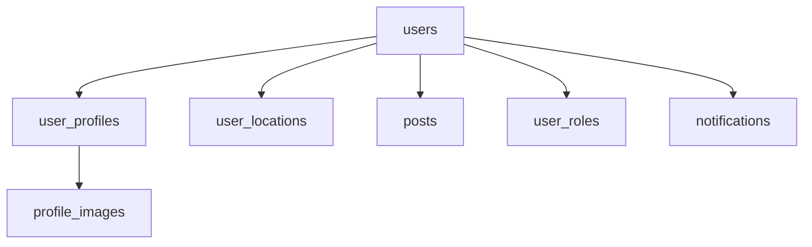

```markdown
---
title: "Virtual Machines Anti-Patterns: When Your Database Schema Becomes a Tower of Babel"
date: 2024-03-20
author: "Alex Carter"
description: "Learn about the 'Virtual Machines' anti-pattern in database design, how it emerges, and why splitting data into isolated tables often leads to performance and maintainability nightmares. Code examples included!"
tags: ["database design", "anti-patterns", "backend engineering", "SQL"]
---

# **Virtual Machines Anti-Patterns: When Your Database Schema Becomes a Tower of Babel**

You’ve heard the saying, *"Don’t reinvent the wheel."* But what if your database schema feels like you’ve reinvented the *entire railway system*—separate tracks for every unique combination of data?

This is the **Virtual Machines (VM) anti-pattern**: a database design where tables are overly fragmented, each storing just enough data to "work" independently—like a virtual machine instance running its own copy of everything. While it might seem flexible at first, it turns into a maintenance nightmare, with awkward joins, excessive data duplication, and a schema that’s harder to query than a parking garage on Black Friday.

In this post, we’ll explore:
- How the VM anti-pattern emerges—and why it’s tempting
- Why it’s a poor choice for most projects
- Better alternatives with practical examples
- Common mistakes to avoid

---

## **The Problem: When "Normalized Just Enough" Becomes "Normalized Too Much"**

Imagine you’re building a **user profile system** for a social network. At first, you start simple:
- `users(user_id, username, email)`
- `posts(post_id, user_id, content, published_at)`

Things work great—until the product team wants:
1. **Profile photos** (blob storage)
2. **Location-based features** (latitude/longitude)
3. **Role-based permissions** (admin, premium, guest)

Now, each of those features *could* be its own table. But if you create them as separate tables—`user_profiles`, `user_locations`, `user_roles`—you’ve just turned a simple `users` table into a Frankenstein’s monster of child tables.

### **The Symptoms of the VM Anti-Pattern**
- **Too many tables**: Every feature gets its own table, even if it’s just `user_id + data`.
- **Awkward joins**: To get a full user profile, you have to stitch together 5+ tables.
- **Duplication**: The same data (e.g., `user_id`) is copied in every table.
- **Slower queries**: Indexes are spread across tables, forcing the database to jump between them.
- **Hard to update**: Changing a field (e.g., `username`) requires updating *every* table that references it.

### **Why It Happens**
Developers often fall into this trap because:
- **Fear of joins**: "If I normalize, my queries will be slow!"
- **Feature creep**: "We’ll need this field later, so let’s store it now."
- **No schema governance**: "It’s just a prototype—we’ll fix it later."

But later never comes. Before you know it, your database looks like this:



This is **not** how databases should scale.

---

## **The Solution: Prefer Denormalization (Within Reason)**

The VM anti-pattern arises from **over-normalization**. Instead of splitting data into tiny, isolated tables, we should:

1. **Keep core data in a single table** (or a few broad tables).
2. **Denormalize strategically** (e.g., embedding common data).
3. **Use composite keys** when necessary.
4. **Avoid over-engineering** for future features.

### **Example: A Healthy User Table (vs. VM Anti-Pattern)**

#### **❌ VM Anti-Pattern (Over-Split)**
```sql
CREATE TABLE users (
    user_id INT PRIMARY KEY,
    username VARCHAR(50),
    email VARCHAR(100)
);

CREATE TABLE user_profiles (
    profile_id INT PRIMARY KEY,
    user_id INT,
    bio TEXT,
    FOREIGN KEY (user_id) REFERENCES users(user_id)
);

CREATE TABLE user_locations (
    location_id INT PRIMARY KEY,
    user_id INT,
    latitude DECIMAL(10,6),
    longitude DECIMAL(11,6),
    FOREIGN KEY (user_id) REFERENCES users(user_id)
);
```
**Problems:**
- Every query needs to `JOIN` `users`, `user_profiles`, `user_locations`.
- If you want a user’s full profile, you need:
  ```sql
  SELECT u.username, p.bio, l.latitude, l.longitude
  FROM users u
  LEFT JOIN user_profiles p ON u.user_id = p.user_id
  LEFT JOIN user_locations l ON u.user_id = l.user_id;
  ```
- Adding a new field (e.g., `premium_status`) requires a new join.

---

#### **✅ Better Approach: Embed Related Data**
```sql
CREATE TABLE users (
    user_id INT PRIMARY KEY,
    username VARCHAR(50),
    email VARCHAR(100),
    bio TEXT,
    latitude DECIMAL(10,6),
    longitude DECIMAL(11,6),
    premium_status BOOLEAN DEFAULT FALSE
);
```
**Advantages:**
- **Single query, no joins**:
  ```sql
  SELECT * FROM users WHERE user_id = 1;
  ```
- **Easier updates**: Change `username` → all fields update in one table.
- **Faster reads**: No database hopping.

---

## **Components/Solutions: When to Denormalize**

Not all data belongs in the same table. Here’s how to structure your schema **without** going overboard:

### **1. Single-Table Inheritance (STI) for Related Data**
If related entities share most fields (e.g., `users` and `premium_users`), embed them:
```sql
CREATE TABLE users (
    user_id INT PRIMARY KEY,
    username VARCHAR(50),
    email VARCHAR(100),
    is_premium BOOLEAN DEFAULT FALSE,
    premium_expiry DATE
);
```

### **2. Composite Keys for Special Cases**
If two tables are tightly coupled (e.g., `posts` and `post_likes`), use a composite key:
```sql
CREATE TABLE post_likes (
    user_id INT,
    post_id INT,
    liked_at TIMESTAMP DEFAULT CURRENT_TIMESTAMP,
    PRIMARY KEY (user_id, post_id)
);
```

### **3. Embedding Common Data (JSON/Columns)**
For optional or rarely accessed data, store it in the same table:
```sql
CREATE TABLE users (
    user_id INT PRIMARY KEY,
    username VARCHAR(50),
    email VARCHAR(100),
    profile_json JSON  -- Flexible for future fields
);
```
**Querying JSON:**
```sql
SELECT username, profile_json->>'bio'
FROM users
WHERE user_id = 1;
```

---

## **Implementation Guide: Step-by-Step**

### **Step 1: Start with a Core Table**
Identify the **single most important table** (e.g., `users`). Keep it broad:
```sql
CREATE TABLE users (
    user_id INT AUTO_INCREMENT PRIMARY KEY,
    username VARCHAR(50) UNIQUE NOT NULL,
    email VARCHAR(100) UNIQUE NOT NULL,
    created_at TIMESTAMP DEFAULT CURRENT_TIMESTAMP
);
```

### **Step 2: Add Related Data Strategically**
Ask:
- *"Is this field used in 90% of queries?"* → Likely belongs in the core table.
- *"Is this field optional and rarely used?"* → Consider JSON or a separate table.

Example:
```sql
-- Core table
ALTER TABLE users ADD COLUMN bio TEXT;

-- Optional extension (if needed later)
CREATE TABLE user_preferences (
    user_id INT PRIMARY KEY,
    theme_mode VARCHAR(10) DEFAULT 'light',
    notifications_enabled BOOLEAN DEFAULT TRUE,
    FOREIGN KEY (user_id) REFERENCES users(user_id)
);
```

### **Step 3: Avoid Over-Join Queries**
If a query needs to join 3+ tables, reconsider the design. Example of a **bad** query:
```sql
SELECT u.username, p.bio, l.city
FROM users u
JOIN user_profiles p ON u.user_id = p.user_id
JOIN user_locations l ON u.user_id = l.user_id;
```
**Fix:** Embed `city` in `user_locations` or move it to `users`.

---

## **Common Mistakes to Avoid**

| **Mistake** | **Why It’s Bad** | **Better Approach** |
|-------------|------------------|----------------------|
| **Every feature gets its own table** | Leads to N+1 query hell, slow reads. | Use a broad core table + JSON/extensions. |
| **Ignoring indexes** | Even with denormalization, queries slow down without proper indexes. | Add indexes on frequently queried columns. |
| **Storing blobs in core tables** | Large fields (e.g., `profile_image`) bloat the main table. | Use separate tables or cloud storage (S3, etc.). |
| **Overusing JOINs** | Complex queries break under load. | Prefer embedded data where possible. |
| **Not planning for growth** | "We’ll fix it later" → schema bloat. | Design for 90% of current needs + 10% future. |

---

## **Key Takeaways**

✅ **Virtual Machines Anti-Pattern** = Too many small tables, too many joins.
✅ **Better:** Keep core data in a single table; denormalize strategically.
✅ **Avoid:**
   - Creating a table for every feature.
   - Using JOINs when you could embed data.
   - Ignoring query performance early.
✅ **When to split:**
   - If data is **rarely used together** (e.g., `audit_logs`).
   - If it’s **huge** (e.g., `user_uploads` → use a separate table).
✅ **Tools to help:**
   - **JSON columns** for flexible but infrequent data.
   - **Composite keys** for unique relationships (e.g., `post_likes`).
   - **Database migrations** (e.g., Flyway, Alembic) to safely refactor.

---

## **Conclusion: Schema Design Should Feel Like LEGO, Not Spaghetti**

The Virtual Machines anti-pattern is a common pitfall, but it’s avoidable with discipline. The key is to **start broad, stay flexible, and resist the urge to split tables just because you can**.

- **Bad:** 10 tables, 5 joins, and a schema that’s a nightmare to update.
- **Good:** 1-2 core tables, embedded data, and queries that run in milliseconds.

Remember: **Databases are for storing data, not managing complexity.** If your schema requires a flowchart to understand, it’s time to refactor.

Now go build something **clean, fast, and maintainable**—your future self will thank you.

---
**Further Reading:**
- [Database Design for Performance](https://use-the-index-luke.com/)
- [Denormalization Patterns](https://www.citusdata.com/blog/denormalization/)
- [JSON in PostgreSQL](https://www.postgresql.org/docs/current/functions-json.html)
```