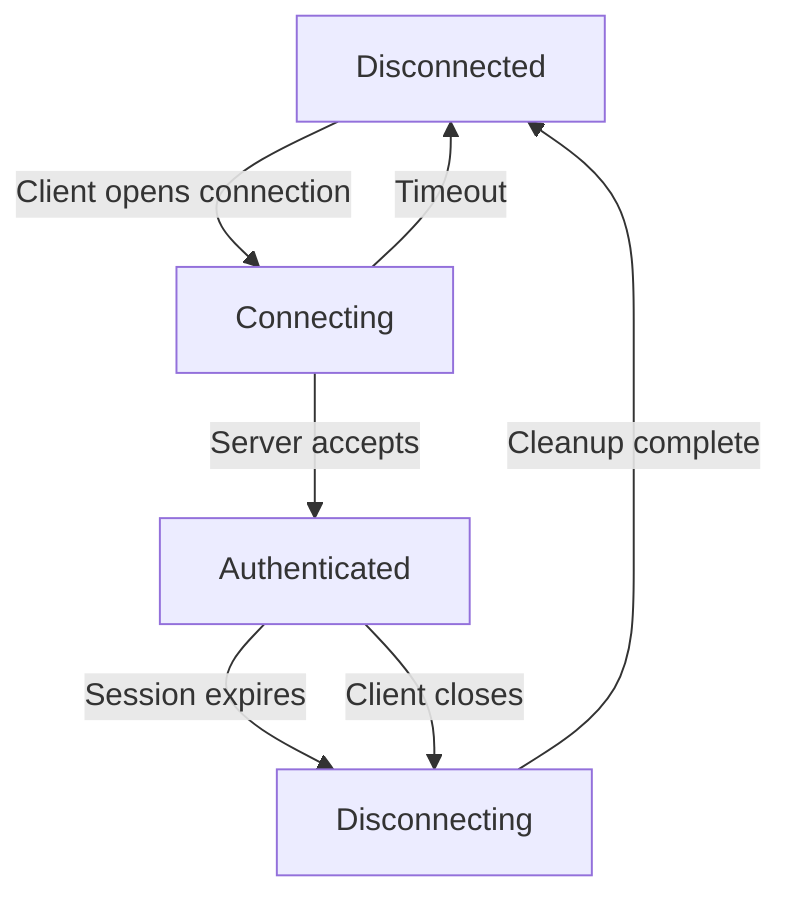

```markdown
# **WebSockets Conventions: The Missing Blueprint for Scalable Real-Time Apps**

Real-time communication is no longer a luxury—it's the expectation. From collaborative tools like Google Docs to live sports scores and chat applications, users demand instant updates without page refreshes. WebSockets, the backbone of modern real-time systems, enable this by maintaining persistent, bidirectional connections between clients and servers.

But here’s the catch: **WebSockets are powerful, but they’re also a minefield without conventions**. Without explicit patterns and practices, even well-designed WebSocket implementations can spiral into chaos—leading to unmaintainable code, inefficient scaling, and a poor user experience. This isn’t just about "best practices"; it’s about **establishing a consistent architecture** that scales with your application while keeping latency low and reliability high.

In this guide, we’ll dissect the **WebSockets Conventions** pattern—a structured approach to designing WebSocket-based systems that balances performance, scalability, and developer experience. We’ll explore real-world challenges, break down the core components, and provide code examples to help you build robust, production-ready real-time applications.

---

## **The Problem: Why WebSockets Need Conventions**

WebSockets solve the **polling inefficiency** of traditional HTTP-based real-time systems. Instead of repeatedly sending `GET` or `POST` requests, WebSockets maintain a single, open connection where both client and server can send messages asynchronously. However, this freedom comes with risks:

### **1. Message Flooding & Scalability Nightmares**
Without proper conventions, a WebSocket server might end up handling millions of concurrent connections while serving arbitrary, unstructured data. Imagine a chat app where every message is sent as a raw JSON blob with no payload limits or encoding standards. As traffic grows, the server could collapse under:
- **Memory leaks** from unclosed connections.
- **CPU overload** due to inefficient serialization.
- **Network congestion** from unoptimized message sizes.

### **2. Lack of Fault Tolerance & Recovery**
WebSockets are persistent, but they’re not immune to failures. If your application doesn’t define:
- **Connection retry logic** for dropped links,
- **Message resending** for failed transmissions,
- **Graceful disconnection** handling,
you risk losing critical updates or flooding clients with duplicate data.

### **3. Developer Overload & Inconsistency**
Teams often jump into WebSockets without a shared understanding of:
- **Message formats** (should all payloads be JSON? Protobuf? Binary?).
- **Error handling** (how are errors encoded?).
- **Authentication** (how do we secure WebSocket endpoints?).

This leads to **spaghetti code**, where each developer implements their own "version" of WebSocket logic, creating a maintenance nightmare.

### **4. No Clear Path for Scaling**
Horizontally scaling WebSockets isn’t as straightforward as HTTP. Conventions like:
- **Session affinity** (which server handles which client?),
- **Load balancing** (how do we distribute connections?),
- **Pub/Sub patterns** (how do we broadcast to many clients?),
are often skipped, forcing teams to scramble when traffic spikes.

---
## **The Solution: The WebSockets Conventions Pattern**

The **WebSockets Conventions** pattern is a framework for designing real-time systems with **predictable behavior, scalability, and maintainability**. It consists of four core pillars:

1. **Message Design & Serialization**
   Define a standardized way to structure and encode messages.
2. **Connection Lifecycle Management**
   Establish rules for opening, maintaining, and closing connections.
3. **Error Handling & Retry Logic**
   Implement robust mechanisms for handling failures gracefully.
4. **Scaling & Load Balancing Strategies**
   Ensure your system can grow without performance degradation.

Let’s dive into each component with practical examples.

---

## **Components of the WebSockets Conventions Pattern**

### **1. Message Design & Serialization**
**Problem:** Unstructured messages lead to parsing errors, inefficiencies, and tight coupling.
**Solution:** Adopt a **contract-first** approach where messages follow a strict schema.

#### **Example: Structured Message Format**
We’ll use a **JSON-based message schema** with a fixed structure:
```json
{
  "type": "chat_message",  // Message type (event, command, etc.)
  "id": "123e4567-e89b-12d3-a456-426614174000",  // Unique identifier
  "timestamp": 1625097600,  // Unix timestamp
  "payload": {              // Serialize data to JSON
    "sender": "user123",
    "content": "Hello, world!",
    "metadata": {
      "is_important": true
    }
  },
  "metadata": {             // Additional context
    "retry_count": 0,
    "ttl": 300  // Time-to-live in seconds
  }
}
```

#### **Why This Works:**
- **Self-describing messages:** The `type` field lets clients and servers know how to process the message.
- **Versioning support:** Add a `version` field to update schemas without breaking existing clients.
- **Efficiency:** JSON is human-readable but can be slow for high-frequency data. For performance-critical apps, consider **Protocol Buffers (Protobuf) or MessagePack**.

#### **Binary vs. Text Messages**
| Approach  | Pros                          | Cons                          | Best For                          |
|-----------|-------------------------------|-------------------------------|-----------------------------------|
| **Text (JSON)** | Human-readable, easy debugging | Larger payloads, slower parsing | Prototyping, low-frequency data   |
| **Binary (Protobuf)** | Smaller size, faster parsing | Requires schema definition     | High-frequency, performance-critical apps |

**Example: Protobuf Schema (chat.proto)**
```protobuf
syntax = "proto3";

message ChatMessage {
  string id = 1;
  string sender = 2;
  string content = 3;
  bool is_important = 4;
  int32 timestamp = 5;  // Unix timestamp
}

message ErrorResponse {
  string error_code = 1;
  string message = 2;
}
```
Compile this with `protoc` and use it for binary message passing.

---

### **2. Connection Lifecycle Management**
**Problem:** Poor connection handling leads to zombies, leaks, and inconsistent states.
**Solution:** Define **clear states and transitions** for the WebSocket lifecycle.

#### **Example: Connection States & Handshake**

**Key Rules:**
1. **Handshake:** Use an initial `handshake` message to:
   - Verify authentication (e.g., JWT in the first payload).
   - Set up session metadata (e.g., user ID, device type).
2. **Heartbeats:** Send periodic pings (`ping`) and expect `pong` responses to detect dead connections.
   ```javascript
   // Example: Heartbeat in Node.js (ws library)
   const client = new WebSocket('ws://example.com');
   client.on('open', () => {
     setInterval(() => client.send(JSON.stringify({ type: 'ping' })), 30000);
   });
   client.on('message', (data) => {
     if (data.type === 'pong') console.log('Alive!');
   });
   ```
3. **Graceful Disconnect:** Close connections with a status code (e.g., `1000` for normal closure) and notify clients.

---

### **3. Error Handling & Retry Logic**
**Problem:** Unhandled errors can cause silent failures or client-timeouts.
**Solution:** Standardize error responses and implement **exponential backoff retries**.

#### **Example: Error Response Format**
```json
{
  "type": "error",
  "code": "auth_failed",
  "message": "Invalid token",
  "details": {
    "retry_after": 5,  // Seconds to wait before retrying
    "action": "reauthenticate"
  }
}
```

#### **Client-Side Retry Logic (Exponential Backoff)**
```javascript
async function sendWithRetry(message, maxRetries = 3) {
  let retryCount = 0;
  let delay = 1000; // Start with 1 second

  while (retryCount < maxRetries) {
    try {
      await client.send(message);
      return;
    } catch (error) {
      retryCount++;
      if (retryCount >= maxRetries) throw error;
      await new Promise(resolve => setTimeout(resolve, delay));
      delay *= 2; // Exponential backoff
    }
  }
}
```

---

### **4. Scaling & Load Balancing Strategies**
**Problem:** WebSockets are stateful; scaling them requires session persistence.
**Solution:** Use **session affinity** and **Pub/Sub patterns**.

#### **Option A: Session Affinity (Sticky Sessions)**
Keep a client’s WebSocket connection on the same server using:
- **DNS-based load balancing** (e.g., AWS ALB with sticky sessions).
- **Redis-backed session store** to track which server owns a user.

**Example: Tracking Sessions in Redis**
```sql
-- Set session on server1 for user123
SET "ws:user123" "server1"
EXPIRE "ws:user123" 3600  -- TTL of 1 hour

-- Check session during load balancing
GET "ws:user123"  --> "server1"
```

#### **Option B: Pub/Sub for Broadcasts**
Use a message broker (e.g., Kafka, RabbitMQ, or Redis Pub/Sub) to fan out messages to multiple clients.

**Example: Redis Pub/Sub for Chat Messages**
```javascript
// Server-side: Publish to channel
redis.publish(`chat:${userId}`, JSON.stringify(message));

// Client-side: Subscribe
redis.subscribe(`chat:${userId}`, (message) => {
  // Handle incoming message
});
```

#### **Option C: Horizontal Scaling with Clustered Gateways**
Use a **WebSocket gateway** (e.g., Socket.io with Redis adapter) to manage connections across multiple servers.
```javascript
// Socket.io with Redis adapter (server-side)
const io = new Server({
  adapter: new RedisAdapter({
    publisher: redisClient,
    subscriber: redisClient
  })
});
```

---

## **Implementation Guide: Step-by-Step**

### **Step 1: Define Your Message Schema**
1. **Choose a serialization format** (JSON, Protobuf, MessagePack).
2. **Version your messages** to support backward compatibility.
3. **Document all message types** (e.g., `chat_message`, `system_notification`).

**Example Schema (JSON):**
```json
{
  "$schema": "https://example.com/messages/v1/schema.json",
  "types": {
    "chat_message": {
      "properties": {
        "sender": { "type": "string" },
        "content": { "type": "string" }
      }
    },
    "error": {
      "properties": {
        "code": { "type": "string" },
        "message": { "type": "string" }
      }
    }
  }
}
```

### **Step 2: Implement Connection Lifecycle**
1. **Add authentication** in the initial handshake.
2. **Enable heartbeats** to detect dead connections.
3. **Gracefully close connections** with status codes.

**Example (Node.js with `ws` library):**
```javascript
const WebSocket = require('ws');
const wss = new WebSocket.Server({ port: 8080 });

wss.on('connection', (ws, req) => {
  // 1. Authenticate initial handshake
  ws.on('message', (data) => {
    const message = JSON.parse(data);
    if (message.type === 'handshake' && isValidToken(message.token)) {
      ws.authenticated = true;
      ws.send(JSON.stringify({ type: 'handshake_ok' }));
    }
  });

  // 2. Send heartbeat every 30 seconds
  setInterval(() => ws.send(JSON.stringify({ type: 'ping' })), 30000);

  // 3. Handle disconnections
  ws.on('close', () => {
    console.log('Client disconnected');
    cleanupSession(ws.userId);
  });
});
```

### **Step 3: Standardize Error Handling**
1. **Define error codes** (e.g., `401` for auth failures).
2. **Implement retries with exponential backoff**.
3. **Log errors** for debugging.

**Example Error Codes:**
| Code   | Description               |
|--------|---------------------------|
| `401`  | Unauthorized              |
| `403`  | Forbidden (insufficient permissions) |
| `429`  | Too Many Requests         |
| `500`  | Internal Server Error     |

### **Step 4: Design for Scalability**
1. **Use a session store** (Redis) for sticky sessions.
2. **Broadcast messages** via Pub/Sub (Redis/Kafka).
3. **Load test** before production.

**Example Scaling Architecture:**
```
Client → [WebSocket Gateway]
         ↓
[Load Balancer] → [WebSocket Server 1] ↔ Redis Pub/Sub
                 ↓
[WebSocket Server 2] ↔ [Database]
```

---

## **Common Mistakes to Avoid**

### **1. Ignoring Connection Limits**
- **Problem:** Allowing unlimited connections without monitoring leads to memory exhaustion.
- **Solution:** Set **max connections per user** and **global limits**.

**Example (Redis-based rate limiting):**
```javascript
const rateLimit = async (userId) => {
  const count = await redis.incr(`ws:${userId}:connections`);
  if (count > 100) throw new Error('Too many active connections');
};
```

### **2. Not Handling Binary Data Properly**
- **Problem:** Mixing text and binary messages without encoding causes corruption.
- **Solution:** Always **base64-encode binary payloads** in JSON.

**Bad:**
```json
{ "type": "image", "data": <binary> }  // Fails!
```
**Good:**
```json
{ "type": "image", "data": "base64encoded..." }
```

### **3. Overloading Servers with Unfiltered Messages**
- **Problem:** Sending large files or unoptimized messages clogs the network.
- **Solution:** **Compress messages** (e.g., gzip) and **set payload limits**.

**Example (Payload Size Limit):**
```javascript
wss.on('connection', (ws) => {
  ws.on('message', (data) => {
    if (data.length > 1024 * 1024) { // 1MB limit
      ws.close(1003, 'Payload too large');
    }
  });
});
```

### **4. Skipping Heartbeats**
- **Problem:** Dead connections aren’t detected, wasting resources.
- **Solution:** Implement **client and server-side heartbeats**.

**Example (Heartbeat Timeout):**
```javascript
let lastHeartbeat = Date.now();
ws.on('message', () => { lastHeartbeat = Date.now(); });

setInterval(() => {
  if (Date.now() - lastHeartbeat > 35000) { // 35s timeout
    ws.close(1008, 'No heartbeat detected');
  }
}, 30000);
```

### **5. Not Testing Failure Scenarios**
- **Problem:** Poorly tested disconnection logic causes data loss.
- **Solution:** Simulate **network drops, timeouts, and server crashes**.

**Example Test Cases:**
1. **Manual disconnect:** Close the client abruptly.
2. **Network partition:** Throttle bandwidth to simulate latency.
3. **Server restart:** Test session recovery.

---

## **Key Takeaways (Quick Reference)**

| Convention               | Best Practice                          | Example Tools/Techniques          |
|--------------------------|----------------------------------------|-----------------------------------|
| **Message Design**       | Use structured schemas (JSON/Protobuf)| JSON Schema, Protobuf, Avro       |
| **Connection Lifecycle** | Define states, heartbeats, gracefully close | `ws` library, long-polling fallback |
| **Error Handling**       | Standardize error codes, retry logic    | Exponential backoff, Redis logging |
| **Scalability**          | Sticky sessions + Pub/Sub              | Redis, Kafka, Socket.io adapter   |
| **Security**             | Authenticate early, validate inputs     | JWT, OAuth2, rate limiting        |

---

## **Conclusion: Build Real-Time Systems That Scale**

WebSockets enable amazing real-time experiences, but **without conventions, they become a technical debt bomb**. By adopting the **WebSockets Conventions** pattern—standardized message formats, robust connection management, scalable architectures, and fail-safe error handling—you can build systems that:
✅ **Scale seamlessly** with traffic spikes.
✅ **Recover gracefully** from failures.
✅ **Stay maintainable** as your team grows.

### **Next Steps:**
1. **Start small:** Apply message conventions to a single feature (e.g., notifications).
2. **Automate testing:** Use tools like **Postman** for WebSocket testing.
3. **Iterate:** Monitor performance and adjust (e.g., switch to Protobuf if latency is high).

Real-time systems are complex, but **conventions reduce the chaos**. Now go build something amazing—with confidence.

---
**Happy coding!**
```