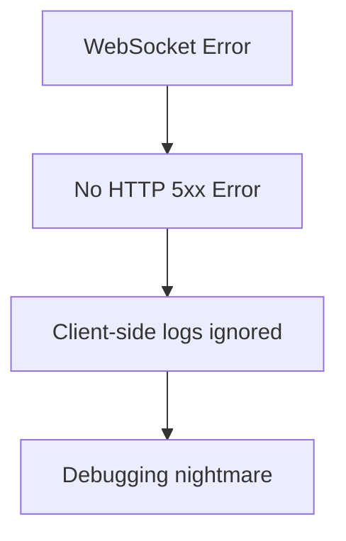
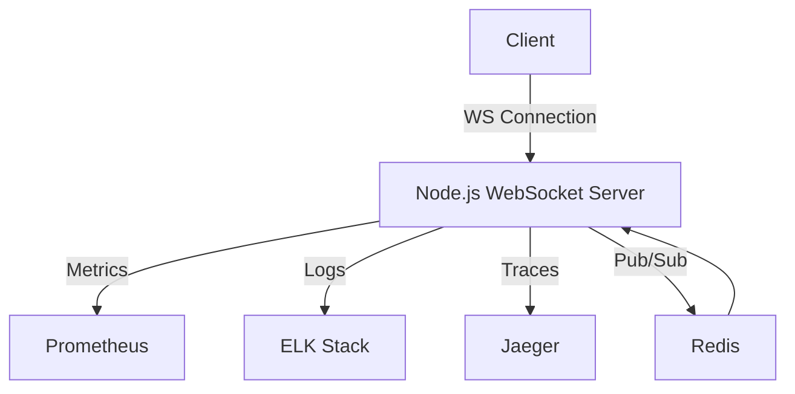

```markdown
# WebSockets Observability: Real-Time Monitoring for Reliable Web Apps


Real-time applications—from chat platforms to live dashboards—rely on **WebSockets** to deliver seamless user experiences. But without proper observability, debugging connection drops, latency spikes, or message bottlenecks can feel like navigating a maze blindfolded.

In this guide, we’ll break down **WebSockets observability**, covering:
- The pain points of unmonitored WebSocket connections
- A practical **observability stack** (metrics, logs, traces)
- Real-world code examples (Node.js + Redis, Python + Prometheus)
- Common pitfalls and how to avoid them

Let’s get started.

---

## The Problem: Why WebSocket Observability Matters

WebSockets enable **persistent, bidirectional** communication between clients and servers—but they come with unique challenges:

### **1. Silent Failures Are Hard to Detect**
Unlike HTTP, WebSocket errors aren’t visible in browser dev tools. A dropped connection might cause:
- **Users seeing stale data** (e.g., chat messages missing)
- **Server resources wasted** on stuck connections



### **2. Performance Bottlenecks Are Invisible**
If your WebSocket server is overwhelmed:
- **Message backlog grows silently**
- **Clients disconnect abruptly** without clear errors

### **3. Debugging Is Fragmented**
- **Client logs** show no errors
- **Server logs** lack context (e.g., "WebSocket closed unexpectedly")
- **No correlation between client-side and server-side events**

Without observability, you’re flying blind.

---

## The Solution: A 3-Pillar Observability Stack

To monitor WebSockets effectively, we need:
1. **Metrics** (quantitative data: latency, errors, connections)
2. **Logs** (detailed events: connection handshakes, disconnections)
3. **Traces** (context-aware debugging: full request flow)

Here’s how to implement it:

---

## **1. Metrics: Track Key WebSocket KPIs**

### **Critical Metrics to Monitor**
| Metric               | What It Tracks                                                                 | Example Use Case                     |
|----------------------|-------------------------------------------------------------------------------|--------------------------------------|
| `ws_connections`     | Active WebSocket connections                                                 | Spikes indicate memory leaks         |
| `ws_messages_sent`   | Messages sent per second                                                      | High values = load testing            |
| `ws_errors`          | Connection/disconnection errors                                              | Debugging flaky connections           |
| `ws_latency`         | P99 message round-trip time (server → client)                                  | Identify slow endpoints              |
| `ws_drop_rate`       | % of dropped connections                                                      | Network issues                       |

### **Example: Node.js + Prometheus**
```javascript
// Configure Prometheus client for WebSocket metrics
const client = require('prom-client');
const { collectDefaultMetrics } = require('prom-client');

// Metrics
const wsConnections = new client.Gauge({
  name: 'ws_connections_total',
  help: 'Number of active WebSocket connections',
});
const wsErrors = new client.Counter({
  name: 'ws_errors_total',
  help: 'Total WebSocket errors',
  labelNames: ['reason'],
});

// Middleware to track connections
app.ws('/chat', (ws, req) => {
  wsConnections.inc();
  ws.on('close', () => wsConnections.dec());

  ws.on('error', (err) => {
    wsErrors.inc({ reason: err.message });
  });

  // ... rest of WebSocket logic
});

collectDefaultMetrics().then(() => {
  app.listen(3000, () => {
    console.log(`Server running. Metrics: http://localhost:3000/metrics`);
  });
});
```

### **Example: Python (FastAPI) + Prometheus**
```python
from fastapi import FastAPI, WebSocket
from prometheus_client import Counter, Gauge, generate_latest, CONTENT_TYPE_LATEST
import asyncio

app = FastAPI()

# Metrics
WS_CONNECTIONS = Gauge('ws_connections_total', 'Active WebSocket connections')
WS_ERRORS = Counter('ws_errors_total', 'WebSocket errors', ['reason'])

@app.websocket("/ws")
async def websocket_endpoint(websocket: WebSocket):
    WS_CONNECTIONS.inc()
    try:
        await websocket.accept()
        while True:
            data = await websocket.receive_text()
            # Process data...

    except Exception as e:
        WS_ERRORS.labels(reason=str(e)).inc()
    finally:
        WS_CONNECTIONS.dec()

@app.get("/metrics")
async def metrics():
    return Response(
        generate_latest(),
        media_type=CONTENT_TYPE_LATEST,
    )
```

### **Visualizing Metrics**
Use **Grafana + Prometheus** to dashboards:
- Track `ws_connections` over time
- Alert on `ws_errors` spikes
- Correlate with system CPU/memory

---

## **2. Logs: Debugging with Context**

### **What to Log**
| Event               | Log Details                                                                 |
|---------------------|-----------------------------------------------------------------------------|
| **Connection Open** | Client IP, User-Agent, WebSocket version                                    |
| **Message Received**| Payload (sanitized), timestamp, client ID                                 |
| **Connection Close**| Reason code, error message, duration                                        |

### **Example: Structured Logging in Node.js**
```javascript
// Using Winston for logs
const winston = require('winston');
const { combine, timestamp, printf } = winston.format;

const logger = winston.createLogger({
  level: 'info',
  format: combine(
    timestamp(),
    printf(({ level, message, timestamp, wsId, clientIp }) => {
      return `${timestamp} [${level}] WS[${wsId}][${clientIp}]: ${message}`;
    })
  ),
  transports: [new winston.transports.Console()],
});

app.ws('/chat', (ws, req) => {
  const wsId = `ws-${Math.random().toString(36).substring(2, 9)}`;

  logger.info('Connection established', { wsId, clientIp: req.ip });

  ws.on('message', (data) => {
    logger.info('Message received', {
      wsId,
      payload: data.toString(),
    });
  });

  ws.on('close', () => {
    logger.warn('Connection closed', { wsId });
  });
});
```

### **Example: Python (Structured Logging)**
```python
import logging
from logging.handlers import RotatingFileHandler
import json

logging.basicConfig(
    level=logging.INFO,
    format='%(asctime)s [%(levelname)s] WS[%(ws_id)s][%(client_ip)s]: %(message)s',
    handlers=[
        RotatingFileHandler('ws.log', maxBytes=1024*1024, backupCount=5),
        logging.StreamHandler(),
    ]
)

logger = logging.getLogger(__name__)

@app.websocket("/ws")
async def websocket_endpoint(websocket: WebSocket):
    ws_id = f"ws-{uuid.uuid4().hex[:8]}"
    logger.info("Connection established", extra={
        "ws_id": ws_id,
        "client_ip": request.client.host,
    })

    try:
        await websocket.accept()
        while True:
            data = await websocket.receive_text()
            logger.info("Message received", extra={
                "ws_id": ws_id,
                "payload": data,
            })
    except Exception as e:
        logger.error("Error in WebSocket", extra={
            "ws_id": ws_id,
            "error": str(e),
        })
    finally:
        logger.info("Connection closed", extra={"ws_id": ws_id})
```

### **Centralized Logging**
Use **ELK Stack (Elasticsearch, Logstash, Kibana)** or **Datadog** to:
- Filter logs by `ws_id` for debugging
- Search for error patterns (e.g., "timeout" in connection closes)
- Correlate logs with metrics

---

## **3. Traces: Full Request Context**

WebSockets are long-lived, so **distributed tracing** helps correlate:
- Client-side events
- Server-side processing
- Backend dependencies (databases, Redis, etc.)

### **Example: OpenTelemetry + Jaeger**
```javascript
// Node.js with OpenTelemetry
const { NodeTracerProvider } = require('@opentelemetry/sdk-trace-node');
const { WebSocketSpanProcessor } = require('@opentelemetry/sdk-trace-web');
const { JaegerExporter } = require('@opentelemetry/exporter-jaeger');
const { registerInstrumentations } = require('@opentelemetry/instrumentation');

// Initialize provider
const provider = new NodeTracerProvider();
provider.addSpanProcessor(new WebSocketSpanProcessor());
provider.addSpanProcessor(
  new SimpleSpanProcessor(new JaegerExporter({
    endpoint: 'http://jaeger:14268/api/traces',
  }))
);
provider.register();

// Instrument WebSocket server
const { WebSocketServer } = require('ws');
const wss = new WebSocketServer({ noServer: true });

server.on('upgrade', (request, socket, head) => {
  const span = provider.getTracer('ws').startSpan('ws_handshake');
  // ... attach context to span ...
  wss.handleUpgrade(request, socket, head, (ws) => {
    wss.emit('connection', ws, request, span);
  });
});

wss.on('connection', (ws, req, span) => {
  ws.on('message', (data) => {
    const msgSpan = provider.getTracer('ws').startSpan('ws_message',
      { parent: span }
    );
    // ... trace message processing ...
    msgSpan.end();
  });
});
```

### **Key Trace Scenarios**
1. **Client → Server → Redis → Server → Client**
   - Trace message routing through a pub/sub system
2. **Failed Connection**
   - Trace why a client disconnected (network error, server crash)
3. **Latency Spikes**
   - Identify slow database queries in the trace

---

## Implementation Guide: Full Observability Stack

### **1. Choose Your Tools**
| Category       | Options                                                                 |
|----------------|-------------------------------------------------------------------------|
| **Metrics**    | Prometheus + Grafana, Datadog, New Relic                                |
| **Logging**    | ELK Stack, Loki + Grafana, Datadog Logs                                  |
| **Tracing**    | OpenTelemetry + Jaeger, Datadog APM, Honeycomb                            |
| **API Gateway**| Kong, Nginx (for WebSocket load balancing)                              |

### **2. Instrumentation Steps**
1. **Add Metrics**
   - Track connections, errors, and latency in your WebSocket server.
   - Export to Prometheus or a cloud provider (e.g., AWS CloudWatch).

2. **Enable Structured Logging**
   - Log `ws_id`, `client_ip`, and `payload` (sanitized).
   - Ship logs to ELK or a centralized logging service.

3. **Set Up Traces**
   - Use OpenTelemetry to trace WebSocket events across services.
   - Visualize in Jaeger or Datadog.

4. **Alert on Anomalies**
   - **Metrics Alerts**: High `ws_errors` or `ws_latency` spikes.
   - **Log Alerts**: Keywords like "timeout" or "disconnect".
   - **Trace Alerts**: Slow traces in a specific microservice.

### **3. Example Stack: Node.js + Redis Pub/Sub**


### **4. Deploy in Kubernetes**
```yaml
# Deployment with Prometheus Sidecar (using Prometheus Operator)
apiVersion: apps/v1
kind: Deployment
metadata:
  name: ws-server
spec:
  replicas: 3
  template:
    spec:
      containers:
      - name: ws-server
        image: my-ws-server:latest
        ports:
          - containerPort: 3000
        env:
          - name: PROMETHEUS_PORT
            value: "3000"
      - name: prometheus-configmap-reloader
        image: jimmidyson/configmap-reload:v0.6.0
        args:
          - --volume-dir=/etc/config
          - --webhook-url=http://localhost:3000/metrics
        volumeMounts:
          - name: config-volume
            mountPath: /etc/config
            readOnly: true
      volumes:
        - name: config-volume
          configMap:
            name: ws-server-metrics-config
```

---

## Common Mistakes to Avoid

### **1. Ignoring Connection Drops**
- **Problem**: Dropped connections are often silent.
- **Fix**: Log `ws.on('close')` with reason codes and duration.

### **2. Not Sampling Traces**
- **Problem**: Full traces for every WebSocket message are expensive.
- **Fix**: Use **OpenTelemetry’s `BatchSpanProcessor`** to sample traces (e.g., 1% of connections).

### **3. Overloading with Logs**
- **Problem**: Logging every `ws.on('message')` fills up storage.
- **Fix**: Log only:
  - First/last messages in a session
  - Errors or large payloads
  - Key events (e.g., user login)

### **4. Missing Context in Metrics**
- **Problem**: Generic "ws_errors_total" doesn’t help debug.
- **Fix**: Label metrics with:
  - `reason`: "timeout", "unexpected_close"
  - `client_ip`: For user-specific issues

### **5. Not Testing Failover**
- **Problem**: WebSocket servers often fail silently during outages.
- **Fix**: Test:
  - Network partitions (e.g., using `clumsy`)
  - Server crashes (kill -9 the process)
  - Redis pub/sub failures (if used)

---

## Key Takeaways

✅ **Observe WebSocket metrics** (`ws_connections`, `ws_errors`, `ws_latency`) to detect issues early.
✅ **Log structured events** with `ws_id` and `client_ip` for debugging.
✅ **Use traces** to correlate client-server dependencies (e.g., Redis, databases).
✅ **Alert on anomalies** (e.g., sudden connection drops).
✅ **Avoid logging everything**—focus on key events and errors.
✅ **Test failover** to ensure reliability under stress.

---

## Conclusion

WebSockets enable **real-time applications**, but without observability, they become a **black box**. By combining **metrics, logs, and traces**, you can:
- **Proactively detect** connection issues
- **Debug faster** with context-rich logs
- **Optimize performance** with latency insights

### **Next Steps**
1. **Start small**: Add Prometheus metrics to your WebSocket server.
2. **Centralize logs**: Ship logs to ELK or Datadog.
3. **Trace critical paths**: Use OpenTelemetry to trace Redis or database calls.
4. **Set up alerts**: Watch for `ws_errors` and slow traces.

Real-time apps demand real-time observability—**don’t leave your users in the dark**.

---
**Want to dive deeper?**
- [Prometheus WebSocket Metrics Guide](https://prometheus.io/docs/guides/websockets/)
- [OpenTelemetry WebSocket Instrumentation](https://opentelemetry.io/docs/instrumentation/)
- [ELK Stack for WebSocket Logs](https://www.elastic.co/guide/en/elasticsearch/reference/current/getting-started-logging.html)

Happy debugging!
```