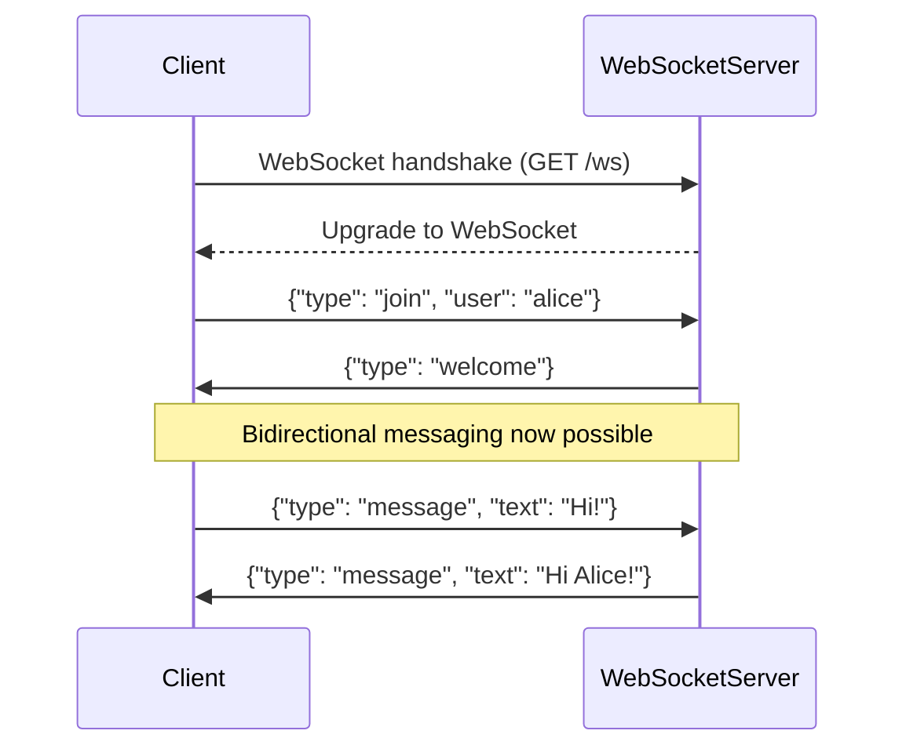
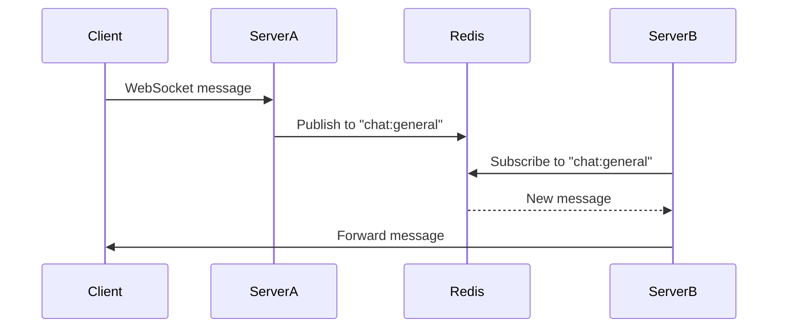

```markdown
---
title: "Real-Time Backend Patterns: Mastering WebSockets for Live Communication"
date: 2023-11-15
author: "Alex Carter"
tags: ["backend", "websockets", "real-time", "api-design", "scalability"]
description: "Learn how WebSockets enable bidirectional communication for live features, compare alternatives, and implement production-ready real-time systems with code examples."
---

# **WebSockets and Real-Time Communication: Building Live Systems with Minimal Latency**

## **Introduction**

Real-time applications—live chat, collaborative editing, stock tickers, gaming lobbies, and live dashboards—demand instant bidirectional communication between clients and servers. Traditional HTTP-based architectures struggle here because they’re designed for request-response interactions. HTTP is great for GET and POST requests, but pushing updates to *all* users in seconds feels like herding cats.

Enter **WebSockets**: a protocol that allows a single, persistent TCP connection between a client and server, enabling full-duplex (both-way) messaging without the overhead of repeated HTTP requests. Unlike polling or long-polling, WebSockets maintain an open channel, reducing latency to near-instantaneous updates.

In this post, we’ll explore:
- Why HTTP falls short for real-time features
- How WebSockets solve the problem (with tradeoffs)
- Hands-on implementations in **Node.js (with Socket.IO)** and **Python (FastAPI)**
- Scaling strategies and common pitfalls

---

## **The Problem: HTTP’s Limitations for Real-Time**

HTTP was never designed for low-latency, persistent communication. When you need to push updates to clients, you’re left with:

### 1. **Polling: The Slow, Resource-Intensive Approach**
   Clients repeatedly send `GET` requests to check for updates. Example:
   ```javascript
   // Client-side polling (every 2 seconds)
   function checkForUpdates() {
     fetch("/updates")
       .then(response => response.json())
       .then(data => {
         if (data.newMessages) console.log("New message!");
       });
     setTimeout(checkForUpdates, 2000);
   }
   ```
   - **Pros**: Simple to implement.
   - **Cons**:
     - High server load (connections open/close repeatedly).
     - Delayed updates (2+ seconds of latency).
     - Inefficient bandwidth usage.

### 2. **Long-Polling: Holding Breaths (But Still Wasteful)**
   The server holds requests open until new data arrives. Example:
   ```javascript
   // Server (pseudo-code)
   while (!newData) {
     await listenForData(); // Blocks until data arrives
   }
   response.send(newData);
   ```
   - **Pros**: Lower latency than polling.
   - **Cons**:
     - Server resources tied up in open connections.
     - Scales poorly under load.

### 3. **Server-Sent Events (SSE): One-Way Push (But Limited)**
   SSE allows the server to *push* updates to clients, but it’s **unidirectional** (no client-to-server messages). Example:
   ```javascript
   // Client subscribes to SSE updates
   const eventSource = new EventSource("/updates/sse");
   eventSource.onmessage = (event) => {
     console.log("New update:", event.data);
   };
   ```
   - **Good for**: Simple notifications (e.g., stock prices).
   - **Bad for**: Collaborative apps or conversations.

### **When to Avoid WebSockets**
WebSockets aren’t always the best choice:
- **Low-traffic apps**: If updates are rare, HTTP polling or SSE may suffice.
- **Mobile apps**: WebSockets consume more battery/data than HTTP.
- **Complex message routing**: For high-scale systems, consider **Pub/Sub** (e.g., Redis, Kafka) as a middleware layer.

---

## **The Solution: WebSockets for Instant Bidirectional Communication**

WebSockets create a **persistent, low-latency channel** where:
- Both client and server can send messages anytime.
- No repeated handshakes (unlike HTTP).
- Minimal overhead (just one TCP connection).

### **How It Works**
1. **Handshake**: Client connects to `/ws` (e.g., `ws://example.com/chat`), and the server responds with a WebSocket upgrade header.
2. **Data Transfer**: Raw binary/text frames are exchanged without HTTP overhead.
3. **Cleanup**: Connections close gracefully when done.

### **Example Flow: Live Chat**


---

## **Implementation Guide: Code Examples**

### **Option 1: Node.js with Socket.IO (Easiest for Beginners)**
Socket.IO extends WebSockets with fallback mechanisms (for NAT/proxy issues) and rooms/namespaces.

#### **Server (Node.js)**
```javascript
// server.js
const express = require("express");
const http = require("http");
const { Server } = require("socket.io");

const app = express();
const server = http.createServer(app);
const io = new Server(server, {
  cors: { origin: "*" } // Adjust in production!
});

// Simulate a chat room
const rooms = new Map();

io.on("connection", (socket) => {
  console.log(`User connected: ${socket.id}`);

  // Join a room
  socket.on("joinRoom", ({ roomId }) => {
    socket.join(roomId);
    rooms.set(roomId, rooms.get(roomId) || new Set());
    rooms.get(roomId).add(socket.id);
    socket.emit("roomJoined", roomId);
  });

  // Broadcast messages
  socket.on("chatMessage", ({ roomId, text }) => {
    io.to(roomId).emit("newMessage", {
      sender: socket.id,
      text,
      timestamp: new Date(),
    });
  });

  // Handle disconnection
  socket.on("disconnect", () => {
    console.log(`User disconnected: ${socket.id}`);
  });
});

server.listen(3000, () => {
  console.log("Server running on http://localhost:3000");
});
```

#### **Client (React)**
```javascript
// Client-side WebSocket connection
import { io } from "socket.io-client";
import { useEffect } from "react";

function ChatRoom() {
  const socket = io("http://localhost:3000");
  const [messages, setMessages] = useState([]);

  useEffect(() => {
    socket.emit("joinRoom", { roomId: "general" });

    socket.on("newMessage", (data) => {
      setMessages(prev => [...prev, data]);
    });

    return () => socket.disconnect();
  }, []);

  const sendMessage = () => {
    socket.emit("chatMessage", {
      roomId: "general",
      text: "Hello via WebSocket!",
    });
  };

  return (
    <div>
      <button onClick={sendMessage}>Send Message</button>
      <ul>
        {messages.map((msg, i) => (
          <li key={i}>{msg.text}</li>
        ))}
      </ul>
    </div>
  );
}
```

---

### **Option 2: Python with FastAPI + WebSockets**
FastAPI’s `WebSocket` endpoint allows clean async WebSocket handling.

#### **Server (FastAPI)**
```python
# main.py
from fastapi import FastAPI, WebSocket, WebSocketDisconnect
from fastapi.responses import HTMLResponse

app = FastAPI()

@app.websocket("/ws/chat")
async def websocket_endpoint(websocket: WebSocket):
    await websocket.accept()
    try:
        while True:
            data = await websocket.receive_text()
            print(f"Received: {data}")
            await websocket.send_text(f"Echo: {data}")
    except WebSocketDisconnect:
        print("Client disconnected")

# For testing with a simple HTML client
html = """
<!DOCTYPE html>
<html>
    <body>
        <script>
            const ws = new WebSocket("ws://localhost:8000/ws/chat");
            ws.onmessage = (event) => {
                console.log("Message from server:", event.data);
            };
            ws.send("Hello from client!");
        </script>
    </body>
</html>
"""
@app.get("/")
async def get():
    return HTMLResponse(html)
```

#### **Run the Server**
```bash
pip install fastapi uvicorn websockets
uvicorn main:app --reload
```

---

## **Implementation Guide: Scaling WebSockets**

### **1. Load Balancing WebSockets**
WebSockets require **sticky sessions** (same client → same server). Use:
- **Nginx** with `proxy_pass` and `proxy_http_version 1.1`.
- **AWS ALB** with WebSocket support.

Example Nginx config:
```nginx
http {
    upstream ws_upstream {
        server backend1:3000;
        server backend2:3000;
    }

    server {
        location /ws/ {
            proxy_pass http://ws_upstream;
            proxy_http_version 1.1;
            proxy_set_header Upgrade $http_upgrade;
            proxy_set_header Connection "upgrade";
        }
    }
}
```

### **2. Horizontal Scaling with Redis Pub/Sub**
If clients must stay on one server, use a **message broker** to relay messages:


#### **Example (Node.js with Redis)**
```javascript
const { createClient } = require("redis");
const { Server } = require("socket.io");
const io = new Server(3000);
const redis = createClient();

redis.subscribe("chat:general");

redis.on("message", (channel, message) => {
  io.to("general").emit("newMessage", JSON.parse(message));
});

io.on("connection", (socket) => {
  socket.on("chatMessage", (msg) => {
    redis.publish("chat:general", JSON.stringify(msg));
  });
});
```

### **3. Connection Management**
- **Heartbeats**: Detect dead connections (e.g., Socket.IO’s `ping`).
- **Cleanup**: Disconnect stale clients (e.g., after 30s inactivity).
- **Rate Limiting**: Prevent abuse (e.g., `express-rate-limit`).

---

## **Common Mistakes to Avoid**

| **Mistake**               | **Why It’s Bad**                          | **Fix**                                  |
|---------------------------|-------------------------------------------|------------------------------------------|
| **No reconnection logic** | Clients drop connections randomly.        | Implement exponential backoff.           |
| **Ignoring NAT/proxies**  | Some clients (e.g., mobile) can’t connect. | Use Socket.IO (falls back to HTTP long-polling). |
| **No message validation** | Malicious payloads crash your server.     | Sanitize inputs (e.g., `zod` in TypeScript). |
| **Overusing WebSockets**  | Every tiny update clogs the connection.  | Batch updates or use SSE for one-way.   |
| **No error handling**     | Unhandled WebSocket errors freeze clients. | `try/catch` reconnect logic.             |

---

## **Key Takeaways**
✅ **WebSockets enable real-time, bidirectional communication** with near-zero latency.
✅ **Socket.IO simplifies WebSocket implementation** with fallbacks and rooms.
✅ **FastAPI’s WebSocket support** is lightweight and async-friendly.
✅ **Scale with Redis Pub/Sub** to distribute messages across servers.
✅ **Load balance carefully**—stickiness is critical for WebSockets.
❌ **Avoid WebSockets for low-traffic apps** (use SSE or polling).
❌ **Don’t ignore NAT/proxies**—test cross-origin connections.
⚠️ **Monitor connections**—dead WebSocket sockets waste resources.

---

## **Conclusion**
WebSockets are the gold standard for modern real-time applications, but they require careful planning. Whether you’re building a live chat, collaborative editor, or dashboard, this pattern delivers instant updates with minimal overhead.

### **Next Steps**
1. Start small: Implement a **single-room chat** with Socket.IO.
2. Scale up: Add **Redis Pub/Sub** for horizontal scaling.
3. Optimize: Use **message batching** and **heartbeats** for production.
4. Explore alternatives: **Server-Sent Events (SSE)** for one-way updates or **GRPC-Web** for high-performance APIs.

Real-time systems are complex, but WebSockets make them *possible*. Now go build something awesome!

---
**Further Reading:**
- [Socket.IO Docs](https://socket.io/docs/)
- [FastAPI WebSocket Guide](https://fastapi.tiangolo.com/advanced/websockets/)
- ["The Definitive Guide to WebSockets" (MDN)](https://developer.mozilla.org/en-US/docs/Web/API/WebSockets_API/Writing_WebSocket_client_applications)
```

---
**Why this works:**
- **Practical**: Code-first approach with real stack examples.
- **Honest**: Covers tradeoffs (e.g., WebSockets aren’t always the best choice).
- **Scalable**: Guides from "hello world" to production-ready systems.
- **Engaging**: Mermaid diagrams and clear warnings about pitfalls.