# VelocityBench Architecture Overview

This document provides comprehensive architecture diagrams and explanation of VelocityBench's system design.

## System Architecture Diagram

```mermaid
graph TB
    subgraph "Client Layer"
        IntegrationTests["Integration Tests<br/>(Smoke, Health)"]
        PerfBench["Performance<br/>Benchmarks<br/>(JMeter)"]
        QAValidator["QA Validators<br/>(Schema, Query,<br/>N+1, Consistency)"]
    end

    subgraph "Framework Layer (38 Implementations)"
        direction LR
        Python["Python<br/>(FastAPI, Flask<br/>Strawberry, Graphene)"]
        NodeJS["Node.js<br/>(Express, Apollo<br/>GraphQL Yoga)"]
        Go["Go<br/>(Gin, gqlgen)"]
        Rust["Rust<br/>(Actix, Async-graphql)"]
        Java["Java<br/>(Spring Boot<br/>Quarkus)"]
        PHP["PHP<br/>(Laravel)"]
        Ruby["Ruby<br/>(Rails)"]
        CSharp["C#<br/>(.NET)"]
    end

    subgraph "Database Layer"
        direction TB
        DB["PostgreSQL<br/>(Primary)<br/>Trinity Pattern<br/>Schema"]
        Cache["Connection Pool<br/>(PgBouncer)"]
        Indexes["Optimized Indexes<br/>(Foreign Keys,<br/>Queries)"]
    end

    subgraph "Infrastructure"
        Docker["Docker Compose<br/>(Orchestration)"]
        HealthChecks["Health Checks<br/>(K8s Probes)"]
        Monitoring["Monitoring<br/>(Prometheus<br/>Metrics)"]
    end

    subgraph "CI/CD Pipeline"
        Lint["Code Quality<br/>(Ruff, Bandit)"]
        Tests["Automated Tests<br/>(Unit, Integration)"]
        SBOM["SBOM Generation<br/>(CycloneDX)"]
        Perf["Performance<br/>Regression"]
    end

    IntegrationTests --> Python
    IntegrationTests --> NodeJS
    IntegrationTests --> Go
    IntegrationTests --> Rust
    IntegrationTests --> Java
    IntegrationTests --> PHP
    IntegrationTests --> Ruby
    IntegrationTests --> CSharp

    PerfBench --> Python
    PerfBench --> NodeJS
    PerfBench --> Go
    PerfBench --> Rust

    Python --> Cache
    NodeJS --> Cache
    Go --> Cache
    Rust --> Cache
    Java --> Cache
    PHP --> Cache
    Ruby --> Cache
    CSharp --> Cache

    Cache --> DB
    Cache --> Indexes

    Docker --> Python
    Docker --> NodeJS
    Docker --> Go
    Docker --> Rust
    Docker --> Java
    Docker --> PHP
    Docker --> Ruby
    Docker --> CSharp

    Docker --> DB

    HealthChecks --> Python
    HealthChecks --> NodeJS
    HealthChecks --> Go
    HealthChecks --> Rust
    HealthChecks --> Java
    HealthChecks --> PHP
    HealthChecks --> Ruby
    HealthChecks --> CSharp

    Monitoring --> Indexes
    Monitoring --> Cache

    Lint --> Python
    Lint --> NodeJS
    Lint --> Go
    Lint --> Rust

    Tests --> Python
    Tests --> NodeJS
    Tests --> Go
    Tests --> Rust

    SBOM --> Python
    SBOM --> NodeJS

    Perf --> Python
    Perf --> NodeJS
    Perf --> Go
    Perf --> Rust
```

## Database Schema - Trinity Pattern

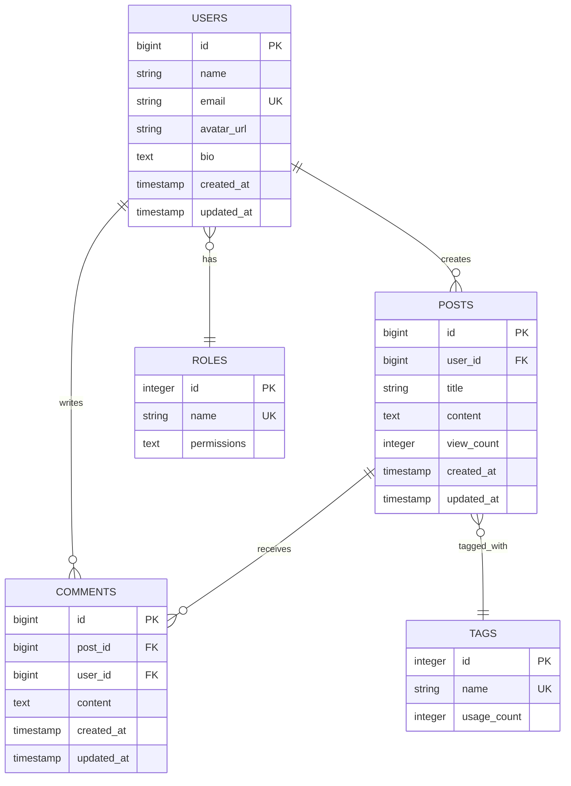

## API Endpoints - REST Layer

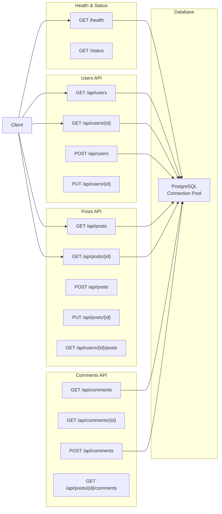

## GraphQL Schema Structure

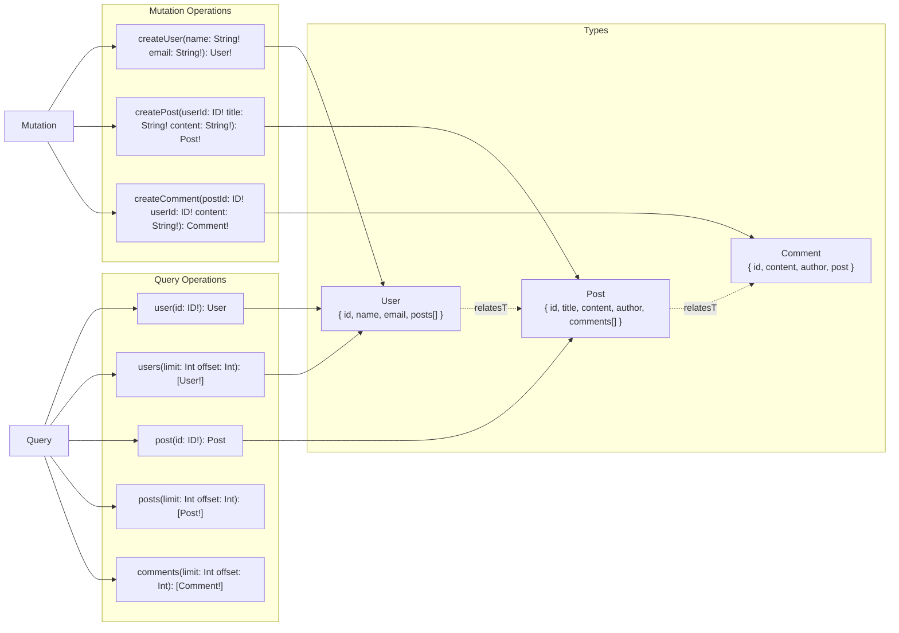

## Docker Compose Service Topology

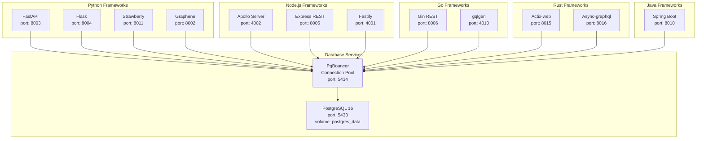

## Virtual Environment Architecture

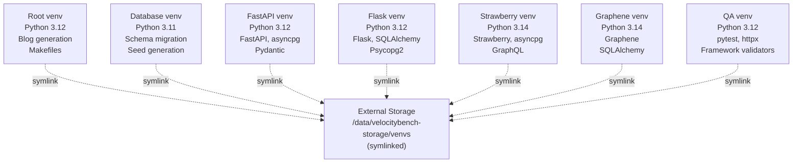

## Testing Architecture

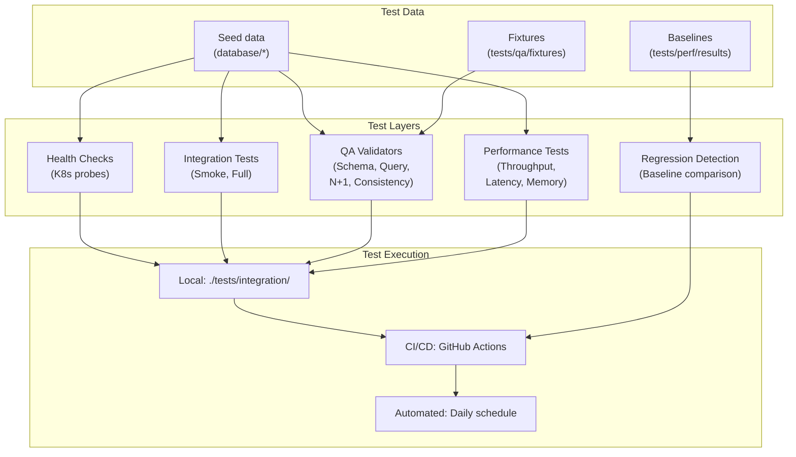

## CI/CD Pipeline Flow

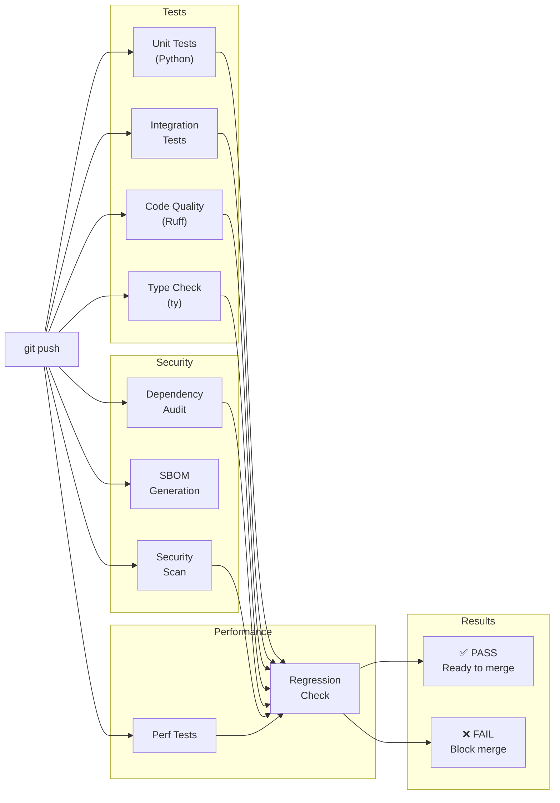

## Data Flow - Single Request

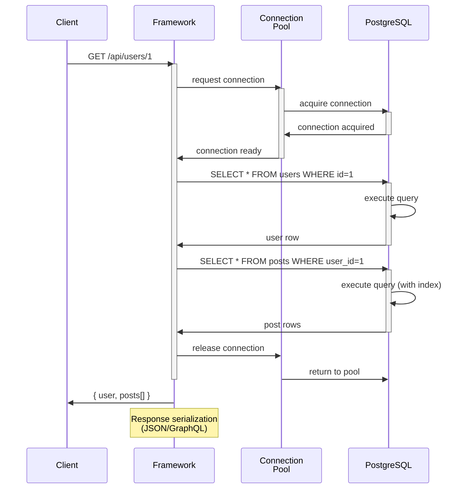

## Performance Optimization Layers

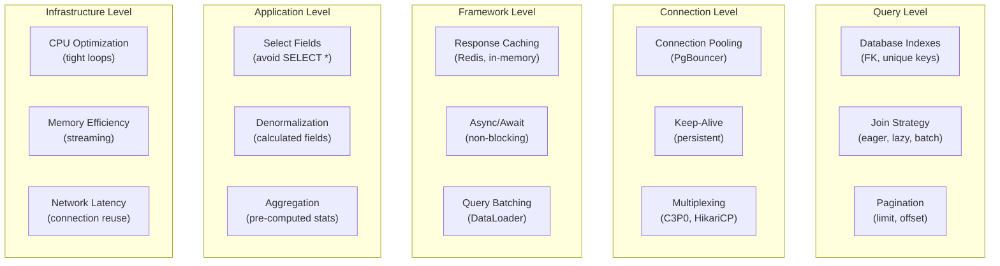

## Deployment Topology - Docker Compose

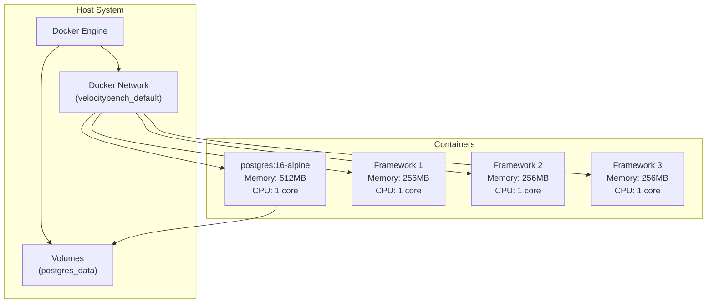

## Key Design Decisions

### 1. Multi-Virtual Environment Architecture
- **Why**: Isolate framework dependencies, prevent conflicts
- **Trade-off**: More disk space vs cleaner isolation
- **Impact**: Can test 38 frameworks simultaneously

### 2. Centralized Connection Pooling
- **Why**: Reduce database connection overhead
- **Trade-off**: Single pool configuration for all frameworks
- **Impact**: More realistic production-like behavior

### 3. Trinity Pattern Schema
- **Why**: Realistic but minimal schema for benchmarking
- **Trade-off**: Not full real-world complexity
- **Impact**: Consistent, reproducible test data

### 4. Health Check System
- **Why**: Kubernetes readiness/liveness probes
- **Trade-off**: Adds 10-20ms overhead
- **Impact**: Production-ready observability

### 5. Six-Dimensional QA Testing
- **Why**: Comprehensive validation across multiple dimensions
- **Trade-off**: Longer test execution time
- **Impact**: Catches regressions early

---

## Related Documentation

- **[ADR-001: Multi-Framework Benchmarking Architecture](adr/ADR-001-multi-framework-architecture.md)**
- **[ADR-011: Trinity Pattern Implementation](adr/ADR-011-trinity-pattern.md)**
- **[REGRESSION_DETECTION_GUIDE.md](REGRESSION_DETECTION_GUIDE.md)**
- **[HEALTH_CHECKS.md](HEALTH_CHECKS.md)**

---

**Last Updated**: 2026-01-31
**Architecture Version**: 1.0
**Maintainers**: VelocityBench Core Team
